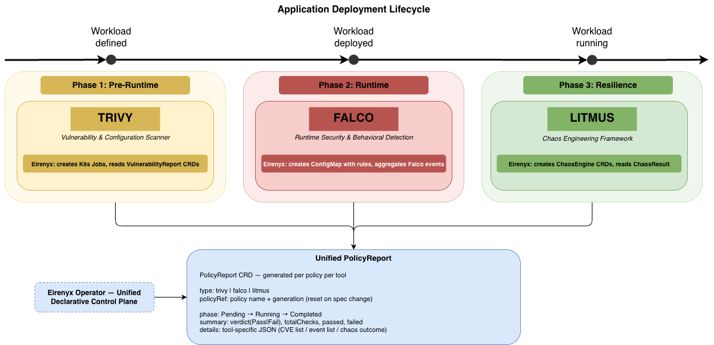
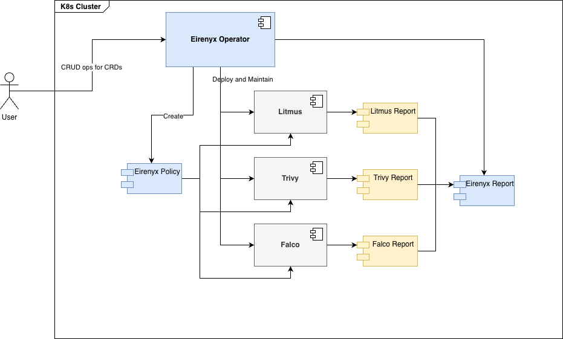

# Chapter 1: Literature Review

---

## 1.1 Kubernetes and the Operator Model

### 1.1.1 Kubernetes — Architecture and Core Principles

Kubernetes [1] is an open-source container orchestration system originally developed by Google and donated to the Cloud
Native Computing Foundation (CNCF) in 2016. It draws directly from Google's internal cluster management system,
Borg [2], which managed tens of thousands of workloads at Google scale for over a decade before Kubernetes was released.
The platform has since become the de facto standard for deploying, scaling, and managing containerised workloads in
cloud-native environments.

At its foundation, Kubernetes models the entire state of a distributed system as a collection of **resources** — typed,
versioned objects stored in a distributed key-value store (etcd). The API server is the single authoritative gateway
through which all system components — both internal controllers and external clients — read and write these objects. No
component writes to etcd directly; all state transitions are mediated through the API server, which enforces validation,
admission control, and optimistic concurrency.

The central operational concept in Kubernetes is the **desired state model**: users declare what they want (a
`Deployment` with three replicas, a `Service` routing traffic on port 80) and the platform continuously drives the
actual state of the system toward the declared state. This is achieved through a set of **controllers** — long-running
processes that watch a subset of the API and take corrective action whenever actual state diverges from desired state.

The reconciliation loop that each controller implements can be described formally:

```
while true:
  desired  = read desired state from API
  actual   = observe current state of cluster
  if actual != desired:
    take action to move actual toward desired
```

This model is described as **level-triggered** rather than *edge-triggered*: a controller does not react to events (
edges) but to the current level of state. The consequence is that reconciliation is inherently idempotent — calling the
reconcile function ten times with the same desired state produces the same outcome as calling it once. This property is
essential for fault tolerance: if a controller crashes and restarts, it simply re-reads the current state and continues
from where it left off, without needing to replay a sequence of events.

Kubernetes ships with a suite of built-in controllers — the `DeploymentController`, `ReplicaSetController`,
`ServiceController`, `NodeController`, and others — each responsible for a specific resource type. These built-in
controllers handle the most common infrastructure concerns but are not extensible to application-specific domain logic.

### 1.1.2 Custom Resource Definitions and the Extension API

Kubernetes' extensibility mechanism is the **Custom Resource Definition (CRD)** [3]. A CRD is a schema definition
registered with the API server that declares a new resource type with its own group, version, and kind. Once registered,
the API server enforces the schema (via OpenAPI v3 validation), provides standard REST endpoints (list, get, create,
update, delete, watch), and stores instances in etcd alongside built-in resources.

This means that a CRD-based resource is a first-class Kubernetes citizen: it can be managed with `kubectl`, observed by
informers, referenced in owner references, targeted by RBAC policies, and watched by controllers. The user experience of
interacting with a custom resource is identical to interacting with a built-in one.

CRDs are defined as annotated Go structs in the Kubebuilder framework. The `controller-gen` tool reads these structs and
generates the CRD YAML manifest automatically:

```go
// +kubebuilder:object:root=true
// +kubebuilder:subresource:status
type Tool struct {
    metav1.TypeMeta   `json:",inline"`
    metav1.ObjectMeta `json:"metadata,omitzero"`
    Spec   ToolSpec   `json:"spec"`
    Status ToolStatus `json:"status,omitzero"`
}
```

The `status` subresource is a critical design pattern in Kubernetes CRDs. By separating `spec` (desired state, written
by users) from `status` (observed state, written by controllers) into distinct API subresources, Kubernetes ensures that
concurrent writes from users and controllers do not overwrite each other. A user applying a new spec update cannot
accidentally clear status fields written by the controller, and vice versa.

### 1.1.3 The Operator Pattern

The Operator pattern, first formalised by CoreOS in 2016 [4], combines a CRD with a custom controller into a unit that
encodes **operational domain knowledge**. The term "operator" is deliberately anthropomorphic: just as a human operator
of a database system knows how to install it, configure it for high availability, take backups, respond to failures, and
perform version upgrades, a Kubernetes Operator encodes exactly that knowledge in code.

The pattern is distinguished from a simple CRD+controller by the sophistication of the reconciliation logic it encodes.
A simple controller might create a Deployment when a custom resource is applied. An Operator understands the full
lifecycle of a complex system: it knows that version X cannot be upgraded directly to version Z (it must go through
version Y), that a specific configuration change requires a rolling restart, and that a particular failure condition
requires recovery in a specific order.

Operators have been adopted across the Kubernetes ecosystem for managing:

- **Stateful databases**: the Zalando PostgreSQL operator [5], MongoDB Community Operator, Redis Operator — each
  encoding database-specific operational knowledge (primary election, replica synchronisation, backup scheduling).
- **Message brokers**: the Strimzi Kafka operator [6], which manages the full Kafka lifecycle including topic creation,
  user management, and rolling upgrades.
- **Networking infrastructure**: the Cert-Manager operator [7], which automates TLS certificate provisioning, renewal,
  and rotation.
- **Security tooling**: the trivy-operator [8], which runs image scans as Kubernetes Jobs and exposes results as
  `VulnerabilityReport` CRDs — a pattern directly used by Eirenyx.

The maturity of an operator is often described using the **Operator Capability Model** defined by Operator
Framework [9], which grades operators on five levels from basic installation (Level 1) through automated operations,
full lifecycle management, deep insights, and autopilot (Level 5). Eirenyx targets Level 3 — full lifecycle management —
by implementing install, upgrade, health monitoring, and clean deletion for each managed tool.

### 1.1.4 Kubebuilder and controller-runtime

**Kubebuilder** [10] is the standard framework for building Kubernetes operators in Go, maintained by the Kubernetes SIG
API Machinery. It provides:

- A CLI that scaffolds a complete operator project in seconds, generating the directory structure, `go.mod`, `Makefile`,
  and initial CRD and controller stubs.
- Marker annotations (e.g. `// +kubebuilder:subresource:status`, `// +kubebuilder:validation:Enum=trivy;falco;litmus`)
  that `controller-gen` reads to produce CRD validation schemas and RBAC manifests.
- Integration with `controller-runtime` for the reconciliation loop, client, and manager.

**controller-runtime** [11] is the runtime library that underpins Kubebuilder. Its key abstractions are:

- **Manager**: bootstraps the operator, registers controllers, initialises the caching client, sets up leader election (
  ensuring only one replica of the operator is active at a time in high-availability deployments), and starts the
  health/readiness HTTP endpoints.
- **Reconciler**: the interface that each controller implements. It has a single method:
  `Reconcile(ctx context.Context, req Request) (Result, error)`. The `Request` carries only the namespace and name of
  the changed object; the controller fetches the full object from the cache. This pull-based model ensures the
  controller always works with the latest state.
- **Client**: a caching Kubernetes client backed by informers. Read operations are served from an in-memory cache,
  dramatically reducing API server load in clusters with many objects. Write operations go directly to the API server.
- **Finalizers**: a mechanism for controllers to perform cleanup before an object is deleted. When a finalizer is
  present on an object, the API server sets `DeletionTimestamp` but does not remove the object. The controller performs
  cleanup, then removes the finalizer, allowing deletion to proceed.

---

## 1.2 Container Security — The Threat Landscape and Tooling Challenges

### 1.2.1 The Container Security Problem Space

The shift to containerised, cloud-native workloads introduces a substantially different security threat landscape
compared to traditional virtual machine deployments. In a VM-based environment, the boundary between workloads is
enforced at the hypervisor level; a compromised VM cannot directly affect its neighbours without exploiting hypervisor
vulnerabilities. Containers, by contrast, share the host kernel. A process running inside a container and a process
running directly on the host execute system calls against the same kernel. This fundamental architectural difference has
significant security implications.

The **container security problem space** spans three distinct phases of a workload's lifecycle, each with different
threat models, detection mechanisms, and tooling requirements [12]:

**Supply chain and pre-deployment security** addresses risks embedded in the artefacts that make up a workload before it
is scheduled. A container image is an OCI-compliant archive of filesystem layers built from a base image (commonly a
Linux distribution) and application-specific layers. Each layer may include operating system packages, language
runtimes, and application dependencies — all of which may contain known vulnerabilities catalogued in the National
Vulnerability Database (NVD) [13] or vendor-specific advisory databases. A 2023 analysis by Aqua Security found that
over 60% of container images pulled from public registries contained at least one critical or high-severity CVE [14].
The risk is compounded by the typical practice of infrequently rebuilding images: a base image pulled months ago may
have accumulated dozens of newly disclosed vulnerabilities.

Beyond CVEs, images may contain hardcoded secrets (API keys, passwords, private keys), world-readable sensitive
configuration files, or binaries with unnecessary setuid bits. Kubernetes manifests themselves introduce another class
of risk: containers configured to run as root, security contexts that allow privilege escalation, hostPath volume
mounts, or containers with overly broad Linux capabilities all increase the blast radius of a compromise.

**Runtime security** addresses threats that materialise while workloads are executing. Even a fully patched, correctly
configured container can be exploited through application-layer vulnerabilities — SQL injection, remote code execution,
deserialization attacks — that allow an attacker to gain control of a container process after it has been admitted to
the cluster. Once inside a container, an attacker may attempt privilege escalation (e.g. by exploiting kernel
vulnerabilities), lateral movement to other pods or namespaces, data exfiltration, or cryptocurrency mining.

Admission control systems such as OPA/Gatekeeper [15] and Kyverno [16] address a subset of runtime risks by enforcing
policy at the point of deployment — preventing pods with dangerous configurations from being scheduled. However,
admission control is fundamentally limited to the information available at admission time: it cannot detect anomalous
behaviour that begins after a workload has started.

**Operational resilience** is the third security dimension. A system that passes all pre-deployment scans and exhibits
no anomalous runtime behaviour may still fail to meet its service-level objectives under real-world failure conditions:
network partitions, node failures, resource exhaustion, dependency unavailability. Security and reliability are not
separate concerns — a system that cannot recover from failures is vulnerable to denial-of-service attacks and
operational failures that have security consequences (e.g. authentication service downtime allowing bypass of access
controls).

### 1.2.2 The Operational Fragmentation Problem

The security tooling ecosystem for Kubernetes has evolved rapidly, producing capable tools for each of the three phases
described above. The challenge is not a lack of tools — it is that these tools have evolved independently, each with its
own:

- **Installation model**: Helm charts with incompatible value schemas, different RBAC requirements, and tool-specific
  namespace conventions.
- **Configuration format**: Trivy scan configurations in YAML or CLI flags; Falco rules in a custom DSL with macro,
  list, and rule constructs; Litmus experiments as ChaosEngine and ChaosExperiment CRDs.
- **Reporting model**: Trivy produces `VulnerabilityReport` and `ConfigAuditReport` CRDs (via trivy-operator) or
  JSON/SARIF output files; Falco emits structured JSON events to stdout, gRPC plugins, or webhook endpoints; Litmus
  produces `ChaosResult` CRDs.
- **Operational lifecycle**: each tool requires separate upgrade procedures, separate secret management (for database
  credentials, webhook endpoints, API keys), and separate monitoring and alerting configurations.

A platform engineering team operating all three tools must maintain deep expertise across three distinct ecosystems.
When a new team member joins, they must learn three separate configuration DSLs, three separate operational runbooks,
and three separate dashboards. When a security finding is detected, correlating a Trivy CVE with a Falco runtime alert
and a Litmus experiment result to understand the full risk profile of a workload requires manual cross-referencing of
three incompatible data models.

This fragmentation is not a hypothetical concern. The CNCF's 2023 Cloud Native Security Whitepaper [17] identifies "
security tooling complexity and integration overhead" as a primary barrier to consistent security practice in Kubernetes
environments. Surveyed organisations report that security tooling is the second most frequently cited source of
operational toil in cloud-native environments, behind only observability.

### 1.2.3 Existing Integration Approaches and Their Limitations

Several commercial and open-source platforms have attempted to address the integration problem:

**Commercial platforms** — Aqua Security's commercial platform, Sysdig Secure, and Palo Alto Networks Prisma Cloud —
offer unified dashboards that aggregate findings from multiple scanning tools. These platforms are capable and
well-supported but share three critical limitations: they are **proprietary** (the integration logic is not auditable or
extensible by users), they are typically **cloud-hosted** (introducing data residency concerns for regulated
industries), and they impose **significant vendor lock-in** (migrating away requires replacing the entire security
tooling stack rather than individual components).

**Open-source aggregators** such as Trivy's own Kubernetes scanning mode and the CNCF's Security TAG reference
architectures [18] provide recommendations for multi-tool integration but stop short of providing a concrete
implementation. They describe patterns — "run Trivy scans as part of your CI pipeline and export results to your SIEM" —
without providing the operational automation that a platform engineer needs.

**GitOps-based approaches** using ArgoCD or Flux to manage the installation of multiple security tools solve the
lifecycle management problem but do not address the configuration and reporting integration gap. A GitOps-managed Falco
DaemonSet and a GitOps-managed Trivy deployment are still two separate systems with separate configuration and reporting
models.

The gap that Eirenyx addresses is therefore well-defined: an **open-source, Kubernetes-native operator** that provides a
single declarative interface for the full security tooling lifecycle — installation, configuration, policy management,
and unified reporting — without replacing the underlying tools or requiring proprietary cloud infrastructure.



---

## 1.3 Trivy — Vulnerability and Misconfiguration Scanning

### 1.3.1 Purpose and Scope

Trivy [19] is an open-source, all-in-one vulnerability and misconfiguration scanner developed by Aqua Security and
released in 2019. It addresses the pre-deployment security phase by answering the question: *what known risks are
embedded in the artefacts that make up this workload?*

Trivy's scanning scope spans six target types:

- **Container images**: OCI-compliant images pulled from any registry.
- **Filesystems**: arbitrary directory trees, including unpacked image layers.
- **Git repositories**: source code and dependency manifests in a repository clone.
- **Kubernetes manifests and Helm charts**: YAML configurations for misconfiguration detection.
- **SBOM documents**: Software Bill of Materials in CycloneDX or SPDX format.
- **AWS accounts**: cloud infrastructure misconfigurations via the Trivy AWS provider.

For vulnerability detection, Trivy maintains a local vulnerability database (updated daily from NVD, GitHub Security
Advisories, and vendor-specific sources) and correlates it against package metadata extracted from scanned artefacts.
The correlation covers OS package managers (apt/dpkg, apk, rpm/yum/dnf) and language-specific package managers (
npm/yarn, pip/poetry, cargo, go modules, maven/gradle, composer, gem).

### 1.3.2 How Trivy Works — Technical Architecture

Trivy's scanning pipeline consists of four stages:

**1. Artefact analysis**: Trivy retrieves the target artefact and extracts its components. For a container image, it
pulls the OCI manifest, downloads each layer tarball, and extracts the filesystem. It then walks the filesystem looking
for package metadata files (`/var/lib/dpkg/status`, `node_modules/.package-lock.json`, `go.sum`, etc.) and binary
signatures.

**2. Database lookup**: For each identified package and version, Trivy queries its local vulnerability database for
matching CVE records. The database maps (ecosystem, package name, version range) to CVE identifiers, severity scores (
CVSS v2 and v3), EPSS (Exploit Prediction Scoring System) scores, and fix availability information.

**3. Misconfiguration detection**: For Kubernetes manifests and Helm charts, Trivy applies a set of policy checks
implemented in Rego (the OPA policy language) and its own built-in checks. These detect common misconfigurations:
containers running as root, missing resource limits, privileged containers, host path mounts, missing security contexts.

**4. Result aggregation and output**: Results are aggregated, deduplicated, and serialised in the requested output
format (JSON, SARIF, table, HTML, CycloneDX SBOM).

### 1.3.3 The trivy-operator

The **trivy-operator** [8] is a Kubernetes operator that automates Trivy scanning within a cluster. Rather than running
Trivy as a CLI tool in CI pipelines (which only captures a snapshot at build time), the trivy-operator continuously
monitors the cluster and scans every container image that is running. It achieves this by:

1. Watching `Pod` and `ReplicaSet` objects for new or updated container images.
2. Creating a Kubernetes `Job` for each unique image that requires scanning.
3. The Job runs a Trivy container that scans the image and writes results to stdout as JSON.
4. The operator reads the Job's output and creates or updates a `VulnerabilityReport` CRD in the same namespace as the
   scanned workload.

The `VulnerabilityReport` CRD provides a structured, queryable representation of the scan results that persists in etcd
alongside the workload it describes. This is the interface that Eirenyx's `TrivyReportHandler` consumes.

### 1.3.4 The CVSS Severity Model

Trivy classifies vulnerabilities using the **Common Vulnerability Scoring System (CVSS)** [20], a standardised framework
for rating the severity of security vulnerabilities. CVSS v3 scores range from 0 to 10 and map to five severity levels:

| CVSS Score | Severity | Typical impact                                              |
|------------|----------|-------------------------------------------------------------|
| 9.0–10.0   | CRITICAL | Remote code execution, full system compromise               |
| 7.0–8.9    | HIGH     | Significant data exposure, privilege escalation             |
| 4.0–6.9    | MEDIUM   | Limited impact, requires interaction or specific conditions |
| 0.1–3.9    | LOW      | Minimal impact, difficult to exploit                        |
| N/A        | UNKNOWN  | Insufficient information to score                           |

In Eirenyx, the default verdict logic treats CRITICAL and HIGH findings as `Fail` — a deliberate policy choice
reflecting the security industry consensus that vulnerabilities at these levels represent unacceptable risk in
production workloads. MEDIUM and LOW findings are reported but do not affect the verdict, reducing alert fatigue for
platform engineers.

---

## 1.4 Falco — Runtime Security and Anomaly Detection

### 1.4.1 Purpose and the Limits of Admission Control

Falco [21] is a cloud-native runtime security project originally developed by Sysdig in 2016 and donated to the CNCF in
2018, achieving graduated project status in 2020. It addresses the runtime security phase by answering the question: *is
this workload behaving as expected while it is running?*

To understand why Falco is necessary, it is important to understand the limits of admission-time security controls.
Admission controllers — OPA/Gatekeeper, Kyverno, the Kubernetes PodSecurity admission controller — operate at the point
when a Pod specification is submitted to the API server. They can reject pods with dangerous configurations (privileged
containers, hostPath mounts, missing security contexts) and enforce policy compliance at deployment time. However, they
have a fundamental temporal limitation: they only observe the *declared* state of a workload, not its *runtime
behaviour*.

Consider the following scenarios that admission control cannot detect:

- A web application container is admitted with a perfectly compliant security context, but is later exploited via a SQL
  injection vulnerability that allows an attacker to execute arbitrary shell commands. The container begins spawning
  shell processes — a clear indicator of compromise.
- A container is compromised and begins establishing outbound connections to a command-and-control server on an unusual
  port.
- A privileged container (admitted for a legitimate reason, such as a network plugin) begins reading sensitive files
  outside its intended scope.
- A dependency with a known RCE vulnerability is exploited at runtime to download and execute a malicious binary.

All of these behaviours are undetectable by any admission-time policy engine because they occur *after* the workload has
been admitted. Runtime security requires a different approach: continuous observation of what containers are actually
doing.

### 1.4.2 How Falco Works — Kernel-Level Observation

Falco operates by intercepting **system calls** (syscalls) — the interface through which all processes, including
containerised ones, request services from the Linux kernel. Every process-level action that has security relevance
involves a syscall: creating a file (`open`, `creat`), spawning a process (`execve`, `fork`), establishing a network
connection (`connect`, `bind`, `accept`), reading kernel memory (`ptrace`), and so on.

Falco intercepts syscalls using one of two kernel instrumentation mechanisms:

**Kernel module**: a loadable kernel module that hooks into the Linux kernel's system call table using the `tracepoint`
infrastructure. The module intercepts syscalls at the lowest possible layer, providing comprehensive coverage with
minimal overhead. This approach requires the ability to load kernel modules on worker nodes, which may be restricted in
some environments.

**eBPF probe**: an extended Berkeley Packet Filter programme compiled to eBPF bytecode and loaded into the kernel via
the `bpf()` syscall. eBPF programmes run in a sandboxed virtual machine inside the kernel, verified by the kernel's eBPF
verifier before execution to ensure they cannot crash the kernel or access arbitrary memory. eBPF is available on Linux
kernels 4.14+ and is the preferred approach in modern Kubernetes environments because it does not require a full kernel
module and works in environments where kernel module loading is restricted (e.g. GKE, EKS with Bottlerocket nodes).

In both cases, Falco runs as a DaemonSet — one pod per node — ensuring that all containers on every node are observed.
The collected syscall events are enriched with Kubernetes metadata (pod name, namespace, container image, labels) by
querying the Kubernetes API, then passed through the rules engine.

### 1.4.3 The Falco Rules Engine

Falco's rules are expressed in a YAML-based domain-specific language. A rule consists of:

- **condition**: a filter expression over syscall event fields that must be true for the rule to fire.
- **output**: a message template that describes the event, populated with field values.
- **priority**: one of `EMERGENCY`, `ALERT`, `CRITICAL`, `ERROR`, `WARNING`, `NOTICE`, `INFORMATIONAL`, `DEBUG`.
- **tags**: arbitrary labels for categorisation and filtering.

Rules make use of **macros** (reusable filter fragments) and **lists** (reusable value sets) to avoid repetition. A
simplified example:

```yaml
- macro: spawned_process
  condition: evt.type = execve and evt.dir = <

- list: shell_binaries
  items: [ bash, sh, zsh, ksh, fish ]

- rule: Terminal shell in container
  desc: A shell was spawned in a container
  condition: >
    spawned_process and
    container and
    proc.name in (shell_binaries) and
    not proc.pname in (shell_binaries)
  output: >
    Shell spawned in container (user=%user.name container=%container.name
    image=%container.image.repository:%container.image.tag
    shell=%proc.name parent=%proc.pname)
  priority: WARNING
  tags: [ shell, container ]
```

Falco ships with a default ruleset maintained by the community covering the most common attack patterns. Users can
extend this ruleset with custom rules or override default rules using append/override directives. In Eirenyx, the
`FalcoEngine` serialises the policy's `spec.falco` object into a ConfigMap that Falco mounts as an additional rules
file, allowing new rules to take effect without restarting the DaemonSet.

### 1.4.4 Falco Alerting and Output

When a rule fires, Falco emits a structured alert containing the rule name, priority, output message, and all relevant
event fields. Alerts can be routed to multiple outputs simultaneously: stdout (for log aggregation), gRPC (for
Falcosidekick, a fan-out routing tool), HTTP webhooks, Slack, PagerDuty, and others.

In the context of Eirenyx, Falco's alerting model is consumed by the `FalcoReportHandler`: the count of events matching
the observed rule name during the observation window determines the `PolicyReport` verdict. A non-zero event count means
the rule fired — meaning the observed anomalous behaviour occurred — and the verdict is `Fail`.

---

## 1.5 LitmusChaos — Chaos Engineering and Resilience Validation

### 1.5.1 The Chaos Engineering Discipline

Chaos engineering is the practice of deliberately injecting controlled failures into a system to build confidence in its
ability to withstand turbulent conditions in production. The discipline was pioneered by Netflix through their Chaos
Monkey tool [22], which randomly terminated EC2 instances in production to force engineers to build services that could
tolerate instance failure. The principles were formalised in the *Principles of Chaos Engineering* [23]:

1. **Build a hypothesis around steady-state behaviour**: define what "normal" looks like (e.g. error rate < 0.1%,
   latency p99 < 200ms).
2. **Vary real-world events**: inject failures that actually occur in production (instance terminations, network
   latency, disk failures).
3. **Run experiments in production**: confidence from testing in a staging environment that does not reflect production
   load and topology is limited.
4. **Automate experiments to run continuously**: a single chaos experiment run once provides a point-in-time snapshot;
   continuous experiments provide ongoing assurance.
5. **Minimise blast radius**: start with small, well-understood experiments and expand scope as confidence grows.

The relevance of chaos engineering to security is often underappreciated. A system that is free of known vulnerabilities
and exhibits no anomalous runtime behaviour may still be exploitable through **availability attacks**: deliberate or
accidental conditions that cause the system to fail to serve requests. If a service is taken down by a pod deletion (
which should be handled by Kubernetes' self-healing mechanisms), an attacker can exploit the outage for various
purposes — bypassing authentication services, disrupting audit logging, or creating race conditions in security-critical
code paths.

### 1.5.2 LitmusChaos — Architecture and CRD Model

LitmusChaos [24] is a CNCF incubating project that implements chaos engineering natively for Kubernetes. Unlike earlier
chaos tools (Chaos Monkey, Gremlin) which operated at the infrastructure layer, Litmus models chaos experiments as
Kubernetes Custom Resources, making them fully declarative, auditable, and GitOps-compatible.

The Litmus architecture centres on three CRD types:

**ChaosExperiment**: a library resource that defines the parameters and execution logic for a specific chaos scenario.
Litmus ships a library of pre-built experiments covering the most common failure modes:

| Experiment            | Failure injected                         |
|-----------------------|------------------------------------------|
| `pod-delete`          | Random pod deletion                      |
| `pod-cpu-hog`         | CPU saturation in a container            |
| `pod-memory-hog`      | Memory pressure in a container           |
| `pod-network-latency` | Artificial network latency               |
| `pod-network-loss`    | Packet loss on pod network interface     |
| `node-drain`          | Cordoning and draining a Kubernetes node |
| `disk-fill`           | Filling ephemeral storage                |

Each `ChaosExperiment` is parameterised via environment variables (e.g. `TOTAL_CHAOS_DURATION`, `CHAOS_INTERVAL`,
`TARGET_PODS`) that allow the same experiment definition to be used across different contexts.

**ChaosEngine**: the execution resource that binds a `ChaosExperiment` to a target workload. It specifies:

- `appInfo`: the target workload (namespace, label selector, kind).
- `engineState`: `active` (run the experiment) or `stop` (abort).
- `experiments`: a list of experiment references with their parameter overrides.

When the Litmus operator observes a `ChaosEngine` in the `active` state, it creates a *chaos runner* pod that executes
the experiment against the target workload.

**ChaosResult**: the output resource that the chaos runner creates upon completion. It records the experiment outcome, a
Pass/Fail verdict, and execution metadata (start time, end time, probe results).

### 1.5.3 How Litmus Integrates with Eirenyx

In Eirenyx, the `LitmusEngine` creates one `ChaosEngine` CRD per experiment defined in a `Policy`'s
`spec.litmus.experiments` list. The `LitmusReportHandler` reads the experiment configuration to produce a `PolicyReport`
that records which experiments were scheduled. This gives platform engineers a declarative, policy-driven interface for
scheduling chaos experiments: instead of manually creating `ChaosEngine` resources, they create an Eirenyx `Policy` that
encodes the desired experiments, and the operator manages the `ChaosEngine` lifecycle in response.

---

## 1.6 How the Three Tools Work Together

The three tools described above — Trivy, Falco, and Litmus — address the Kubernetes security lifecycle at three
orthogonal layers. No single tool can substitute for another, and the value of each is maximised when they operate in
combination.

### 1.6.1 Complementary Coverage Model

The relationship between the tools can be understood through a temporal model of a workload's lifecycle:

```
Build time          Deployment time         Runtime              Stress test
    |                     |                    |                     |
  [Image built]     [Pod admitted]        [Pod running]     [Failure injected]
       |                  |                    |                     |
     Trivy            Admission             Falco               Litmus
  (CVE scan)         Controller          (syscall rules)   (chaos experiments)
```

**Trivy** operates on the *artefact* — the container image — independently of when or where it runs. It answers: "is
this image safe to run?" A positive Trivy result (no CRITICAL/HIGH CVEs) is a necessary but not sufficient condition for
a workload's security.

**Falco** operates on *running processes* at the kernel level. It answers: "is this running container behaving as
expected?" Falco can detect compromise that Trivy cannot: an attacker who exploits an application vulnerability at
runtime to spawn a shell will be caught by Falco even if the image itself had no CVEs.

**Litmus** operates on the *operational behaviour* of a workload under stress. It answers: "does this workload recover
from failures?" This is orthogonal to both Trivy and Falco: a workload could have no CVEs, exhibit no anomalous
syscalls, yet fail catastrophically when its database connection is dropped — leaving it in a state where security
controls (authentication, audit logging, access control enforcement) are unavailable.

### 1.6.2 The Integration Gap

Despite their complementarity, the three tools have no native integration with each other. They speak different
languages, produce different data formats, and require different operational procedures. A platform engineer who wants
to answer the question "is this workload secure?" must:

1. Run a Trivy scan and interpret the `VulnerabilityReport` CRD.
2. Configure Falco rules and monitor its alert stream via a separate pipeline (Falcosidekick, a SIEM, or log
   aggregation).
3. Create and execute Litmus `ChaosEngine` resources and inspect `ChaosResult` CRDs.
4. Manually correlate findings across three separate systems, using three different data models, with no common
   reference to the workload they all describe.

This manual correlation is not merely inconvenient — it creates **security gaps**. When findings are spread across
separate systems, it is easy to miss the combination of signals that together indicate a serious risk: a workload with a
MEDIUM-severity CVE (below the alert threshold) that is also experiencing Falco runtime alerts (indicating active
exploitation) and that fails its Litmus pod-delete test (indicating it cannot be restarted safely after being killed by
an attacker). Each signal individually is below the response threshold; together they indicate an active compromise.

---

## 1.7 Justification for a Unified Approach

### 1.7.1 The Case for a Control Plane

The operational fragmentation described above is not a property of the individual tools — Trivy, Falco, and Litmus are
each well-designed for their purpose. The fragmentation is a property of the *ecosystem*: tools built independently, for
different audiences, at different times, with no shared design for integration.

The Kubernetes operator pattern provides exactly the right abstraction for building a unified control plane over
heterogeneous tooling. An operator can:

- Abstract tool installation behind a single `Tool` CRD, eliminating the need for platform engineers to understand three
  Helm chart value schemas.
- Abstract policy configuration behind a single `Policy` CRD with tool-specific sub-specifications, providing a common
  entry point for all security configuration.
- Produce a normalised `PolicyReport` CRD for all three tools, enabling cross-tool correlation and a unified view of
  workload security posture.
- Manage the full lifecycle (install, upgrade, health monitoring, deletion) of each tool, enforcing consistency and
  reducing operational toil.

### 1.7.2 Requirements for an Effective Solution

Based on the analysis of the problem space, an effective unified security operator must meet the following requirements:

**R1 — Non-invasive integration**: the operator must manage Trivy, Falco, and Litmus without modifying or replacing
them. Each tool must continue to function independently; the operator adds a management layer on top.

**R2 — Declarative lifecycle management**: installing, configuring, upgrading, and removing each tool must be
expressible as a change to a Kubernetes resource. No kubectl commands, no Helm CLI invocations, no shell scripts.

**R3 — Unified policy model**: security policies for all three tools must be expressible through a common CRD interface.
The platform engineer should not need to learn three separate configuration DSLs to configure all three tools.

**R4 — Normalised reporting**: findings from all three tools must be exposed through a common data model that enables
programmatic consumption, cross-tool correlation, and a unified dashboard view.

**R5 — Kubernetes-native state**: all persistent state must live in Kubernetes Custom Resources. No external database,
no configuration files on disk, no in-memory state that is not recoverable from the Kubernetes API.

**R6 — GitOps compatibility**: all configuration must be expressible as declarative YAML manifests that can be managed
in a Git repository and applied via GitOps tooling (Flux, ArgoCD).

### 1.7.3 Eirenyx as a Solution

Eirenyx satisfies all six requirements through a three-tier architecture:

- The **`Tool` CRD** and `ToolReconciler` address R1 and R2: tool lifecycle is managed declaratively through a single
  resource that drives Helm installs and upgrades.
- The **`Policy` CRD** and `PolicyReconciler` with per-tool `Engine` implementations address R3: a single policy
  resource, with tool-specific sub-specifications, configures all three tools through a common interface.
- The **`PolicyReport` CRD** and per-tool `ReportHandler` implementations address R4: all findings are normalised into a
  common schema with a universal `Verdict` (Pass/Fail) and structured `Details` payload.
- Requirements R5 and R6 are satisfied by the architecture's exclusive use of Kubernetes CRDs for persistence and the
  fully declarative nature of all three resource types.

The following chapter describes the architectural and technological decisions that underpin this design, followed by a
detailed account of the implementation.



---

*Next: [Chapter 2 — Architecture and Technologies](02-architecture.md)*
