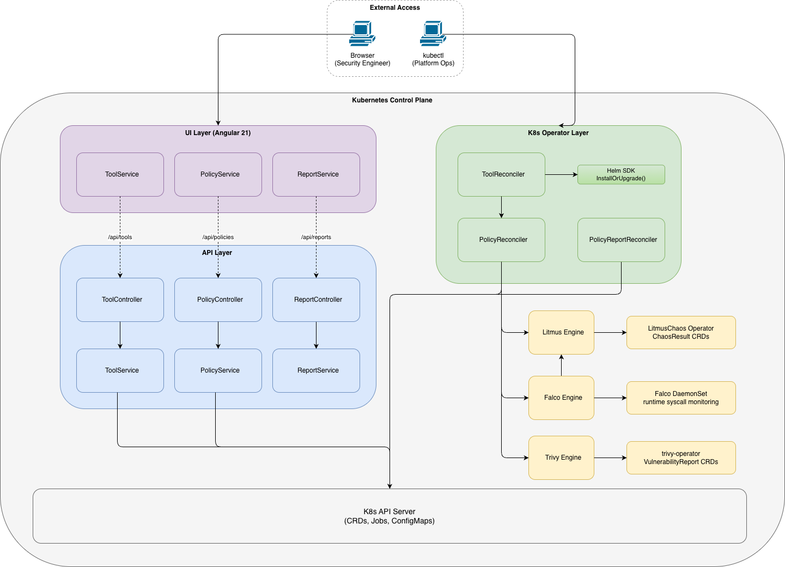

# Chapter 2: Architecture and Technologies

---

## 2.1 Architectural Overview and Design Principles

Eirenyx is composed of three distinct, independently deployable components:

| Component     | Language                | Role                                                                |
|---------------|-------------------------|---------------------------------------------------------------------|
| `eirenyx`     | Go                      | Kubernetes operator — manages tool lifecycle and policy execution   |
| `eirenyx-api` | Go                      | REST API server — HTTP bridge between the UI and the Kubernetes API |
| `eirenyx-ui`  | TypeScript / Angular 21 | Web dashboard — visual interface for managing resources             |

Each component has a single, well-bounded responsibility. The operator is the only component that directly interacts
with Trivy, Falco, and Litmus. The API is a stateless translation layer. The UI consumes the API and renders state. This
separation is not arbitrary — it reflects the principle of **single responsibility at the component level**, which
reduces coupling and makes each component independently testable and replaceable.

The overarching design principle across all three components is: **Kubernetes is the single source of truth**. There is
no external database, no configuration files on disk, and no in-memory state that is not recoverable from the Kubernetes
API. All persistent state lives in Custom Resources stored in etcd. This decision has far-reaching consequences:

- The operator can be restarted at any time without losing state or re-running operations that already succeeded.
- All configuration is expressed as declarative YAML manifests that can be stored in Git and applied via GitOps tools (
  Flux, ArgoCD).
- Every state change is audited by the Kubernetes API server's audit log.
- The API server and UI are always reading from the same authoritative store — there is no cache invalidation problem.

The architecture diagram below illustrates how the three components interact through the Kubernetes API:



---

## 2.2 Go — The Foundation Language

### 2.2.1 Why Go?

All backend components of Eirenyx are written in **Go** (version 1.25). This is not a coincidence — Go was chosen for
specific, concrete reasons that directly address the requirements of Kubernetes-native development.

**The entire Kubernetes ecosystem is written in Go.** The Kubernetes API server, `kubelet`, `kubectl`,
`controller-runtime`, `client-go`, Helm, and virtually every major operator in production (Cert-Manager, Crossplane,
Prometheus Operator, Argo CD) are Go programs. This means:

- The Kubernetes type system is a Go type system. Working with Kubernetes objects in Go gives you the full, typed API —
  no dynamic client, no JSON map traversal, no runtime type assertions. The compiler catches missing fields, incorrect
  types, and API misuse before the program runs.
- Every library you need — Kubernetes client, Helm SDK, controller framework — is Go-native and actively maintained. In
  other languages, these are ports or thin wrappers over REST clients, with lagging support and reduced feature
  coverage.

**Go produces a single, self-contained binary.** There is no runtime to install, no virtual machine to manage, no
dependency resolution at startup. The operator container image is a scratch image with a single binary. This minimises
attack surface (no shell, no package manager, no unnecessary tools) and reduces image size to under 50 MB.

**Go has simple, explicit error handling.** In an operator that may perform dozens of Kubernetes API calls per
reconciliation cycle, it is critical that errors are handled explicitly and never silently swallowed. Go's `error`
return value convention forces every error to be either handled or explicitly propagated. Compare this to exceptions in
Java or Python, where errors can propagate silently through call stacks without being logged or acted upon.

**Go's concurrency model fits the operator pattern.** controller-runtime runs one goroutine per reconciliation request.
Go's goroutine model makes this trivially efficient — thousands of goroutines are practical — and Go's `context.Context`
provides clean cancellation semantics for long-running Kubernetes API operations.

### 2.2.2 Alternatives Considered

| Language       | Reason not chosen                                                                                                                                                                    |
|----------------|--------------------------------------------------------------------------------------------------------------------------------------------------------------------------------------|
| **Python**     | No compile-time type safety against Kubernetes API types; significantly higher memory baseline; slower startup; the `kopf` operator framework is less mature than controller-runtime |
| **Java / JVM** | High memory and CPU overhead for a long-running in-cluster process; slow startup (affects leader election); container images are an order of magnitude larger                        |
| **Rust**       | Excellent performance and safety, but Kubernetes client ecosystem is immature (`kube-rs` is capable but lags the Go ecosystem); significantly steeper learning curve                 |
| **Node.js**    | No compile-time type safety; V8 runtime overhead; operator frameworks are experimental                                                                                               |

---

## 2.3 Kubebuilder and the CRD-Driven Design

### 2.3.1 What Kubebuilder Does

**Kubebuilder** [1] is a framework for building Kubernetes operators in Go, maintained by the Kubernetes SIG API
Machinery. Its core value is code generation: instead of writing hundreds of lines of boilerplate to define CRD schemas,
set up controller watches, and wire up the manager, Kubebuilder generates all of this from annotated Go structs.

A minimal Kubebuilder project scaffold takes less than a minute to generate:

```bash
kubebuilder init --domain eirenyx.io --repo github.com/EirenyxK8s/eirenyx
kubebuilder create api --group eirenyx --version v1alpha1 --kind Tool
```

This produces:

```
api/v1alpha1/
  tool_types.go        ← define your spec and status here
  zz_generated.deepcopy.go  ← auto-generated deep copy methods
internal/controller/
  tool_controller.go   ← implement Reconcile() here
config/
  crd/bases/           ← auto-generated CRD YAML
  rbac/                ← auto-generated RBAC manifests
```

The developer fills in the `ToolSpec` and `ToolStatus` structs in `tool_types.go`, adds Kubebuilder marker annotations,
and implements the `Reconcile` method. Everything else — CRD schema generation, RBAC role generation, controller
wiring — is handled by the toolchain.

### 2.3.2 CRD Markers — From Go Annotations to Kubernetes Schemas

Kubebuilder uses Go comment annotations called **markers** to drive code generation. This is how a single Go struct
becomes a fully validated Kubernetes API:

```go
// +kubebuilder:object:root=true
// +kubebuilder:subresource:status
// +kubebuilder:printcolumn:name="Type",type=string,JSONPath=`.spec.type`
// +kubebuilder:printcolumn:name="Enabled",type=boolean,JSONPath=`.spec.enabled`
// +kubebuilder:printcolumn:name="Healthy",type=boolean,JSONPath=`.status.healthy`
type Tool struct {
    metav1.TypeMeta   `json:",inline"`
    metav1.ObjectMeta `json:"metadata,omitzero"`
    Spec   ToolSpec   `json:"spec"`
    Status ToolStatus `json:"status,omitzero"`
}

type ToolSpec struct {
    // +kubebuilder:validation:Enum=trivy;falco;litmus
    Type ToolType `json:"type"`

    // +kubebuilder:default=false
    Enabled bool `json:"enabled"`

    // +optional
    Namespace string `json:"namespace,omitempty"`

    // +optional
    // +kubebuilder:pruning:PreserveUnknownFields
    Values runtime.RawExtension `json:"values,omitempty"`
}
```

The `controller-gen` tool reads these markers and generates:

1. **OpenAPI v3 schema** embedded in the CRD YAML, which the API server enforces at admission time. The `Enum` marker
   causes the API server to reject any `Tool` whose `spec.type` is not one of `trivy`, `falco`, or `litmus` — before the
   operator ever sees the object.

2. **DeepCopy methods** (`zz_generated.deepcopy.go`) required for the controller-runtime cache to safely copy objects
   without aliasing.

3. **RBAC ClusterRole manifests** derived from `// +kubebuilder:rbac:groups=...` markers on controller methods, listing
   exactly the permissions the operator needs.

4. **`kubectl get` table columns** defined by `printcolumn` markers, making `kubectl get tools` show a useful summary
   table rather than just name and age.

The practical consequence is that the Go struct is the single source of truth for the API. There is no separate schema
file to maintain, no YAML to hand-write, no risk of the schema drifting from the code.

### 2.3.3 controller-runtime — The Reconciliation Engine

**controller-runtime** [2] is the library that provides the runtime infrastructure for controllers. Its key components
are:

#### The Manager

The `Manager` is the central supervisor of the operator process. It:

- Initialises the caching Kubernetes client, starting informers for all watched resource types.
- Provides leader election using a Kubernetes `Lease` resource, ensuring only one replica of the operator is actively
  reconciling at a time in high-availability deployments.
- Starts all registered controllers as goroutines.
- Serves liveness (`/healthz`) and readiness (`/readyz`) HTTP endpoints on port 8081.
- Handles graceful shutdown on SIGTERM.

```go
mgr, err := ctrl.NewManager(ctrl.GetConfigOrDie(), ctrl.Options{
    Scheme:                 scheme,
    HealthProbeBindAddress: ":8081",
    LeaderElection:         true,
    LeaderElectionID:       "eirenyx-leader-election",
})
```

#### The Caching Client

The controller-runtime `Client` is not a simple REST client — it is a **caching client** backed by informers. When a
controller calls `r.Get(ctx, key, &tool)`, the client serves the response from an in-memory cache that is kept up to
date by a watch stream from the API server. This means:

- Read operations do not hit the API server at all — they are served locally.
- A cluster with 1000 `Tool` objects across 50 reconciliation goroutines generates no per-read API server traffic.
- The cache provides strong consistency within a single reconciliation cycle: once an object is fetched, it will not
  change mid-reconciliation (the cache reflects the state at the time the watch event was received).

Write operations (`Create`, `Update`, `Patch`, `Delete`) go directly to the API server to maintain actual consistency.

#### Finalizers and Graceful Deletion

Finalizers are Kubernetes' mechanism for ensuring cleanup logic runs before an object is deleted. When an object has a
finalizer set, deleting it causes the API server to set `DeletionTimestamp` on the object without removing it from etcd.
The controller detects `DeletionTimestamp`, performs cleanup (in Eirenyx: running `helm uninstall`), and then removes
the finalizer. Only when all finalizers are removed does the API server delete the object.

Without finalizers, deleting a `Tool` resource in Eirenyx would remove it from Kubernetes but leave the
Trivy/Falco/Litmus Helm release running in the cluster — an orphaned, unmanaged installation. The finalizer pattern
prevents this.

```go
// Registration (on first reconcile)
controllerutil.AddFinalizer(&tool, eirenyx.ToolFinalizer)
r.Patch(ctx, &tool, patch)

// Cleanup (on deletion)
if !tool.DeletionTimestamp.IsZero() {
    svc.EnsureUninstalled(ctx, &tool)  // helm uninstall
    controllerutil.RemoveFinalizer(&tool, eirenyx.ToolFinalizer)
    r.Patch(ctx, &tool, patch)
}
```

#### Owner References and Garbage Collection

Kubernetes supports **owner references** — metadata fields on an object that declare another object as its owner. When
an owner is deleted, the Kubernetes garbage collector automatically deletes all objects that reference it as owner.

In Eirenyx, this creates a clean ownership hierarchy:

```
Tool (owner)
  └── Policy (owned by Tool)
        └── PolicyReport (owned by Policy)
```

Deleting a `Tool` triggers deletion of all its `Policy` objects, which in turn triggers deletion of all `PolicyReport`
objects. No explicit cleanup code in the operator is needed for this cascade — it is a property of the Kubernetes
garbage collector.

---

## 2.4 Helm SDK — Programmatic Chart Management

### 2.4.1 What Helm Is and Why It Matters

**Helm** [3] is the package manager for Kubernetes. A Helm *chart* is a versioned, templated bundle of Kubernetes YAML
manifests that describes a complete application deployment. Charts encapsulate all the resources an application needs —
Deployments, Services, ServiceAccounts, ClusterRoles, ConfigMaps, CRDs — along with a `values.yaml` file that exposes
configuration knobs without requiring users to modify the templates directly.

Trivy, Falco, and Litmus are each distributed as official Helm charts maintained by their respective projects:

| Tool   | Helm chart                    | What it installs                                    |
|--------|-------------------------------|-----------------------------------------------------|
| Trivy  | `aquasecurity/trivy-operator` | Deployment, RBAC, CRDs for VulnerabilityReport etc. |
| Falco  | `falcosecurity/falco`         | DaemonSet, kernel module/eBPF probe, default rules  |
| Litmus | `litmuschaos/litmus`          | Operator Deployment, CRDs for ChaosEngine etc.      |

Using Helm to install these tools is standard practice in the Kubernetes ecosystem. The alternative — applying raw YAML
manifests — forfeits versioning, upgrade management, and the ability to customise installation parameters.

### 2.4.2 Helm SDK vs. Helm CLI

Eirenyx uses the **Helm Go SDK** (`helm.sh/helm/v3`) directly rather than shelling out to the `helm` CLI binary. This
distinction is significant:

**Using the CLI (not chosen):**

```go
// This approach has serious problems:
cmd := exec.Command("helm", "install", "trivy",
    "aquasecurity/trivy-operator",
    "--namespace", "trivy-system")
output, err := cmd.CombinedOutput()
// - Requires helm binary in container image
// - Cannot inspect structured result
// - Error handling is string parsing
// - No programmatic access to release state
```

**Using the SDK (chosen):**

```go
// Programmatic, typed, no external binary required
actionConfig := new(action.Configuration)
actionConfig.Init(restClientGetter, namespace, "secrets", log.Printf)

install := action.NewInstall(actionConfig)
install.ReleaseName = "trivy"
install.Namespace = namespace
install.Wait = true          // block until workload is ready
install.Timeout = 5 * time.Minute

chart, _ := loader.Load(chartPath)
release, err := install.RunWithContext(ctx, chart, values)
// release.Info.Status tells us the exact state
// err is a typed Go error, not a string
```

The SDK approach:

- Eliminates the `helm` binary as a container dependency (smaller, more secure image).
- Provides structured, typed access to release state, chart metadata, and error information.
- Allows `--wait` semantics: the `Install` action blocks until all Deployment replicas are ready or the timeout expires,
  eliminating the need for a separate readiness polling loop.
- Makes the operator self-contained and verifiable — all logic is in auditable Go code.

### 2.4.3 Helm Values and User Customisation

The `ToolSpec.Values` field is a `runtime.RawExtension` — an opaque JSON blob that is passed verbatim to the Helm
install action as chart values. This allows platform engineers to customise the underlying tool installation without
Eirenyx needing to enumerate every possible Helm value:

```yaml
apiVersion: eirenyx.io/v1alpha1
kind: Tool
metadata:
  name: falco
spec:
  type: falco
  enabled: true
  values:
    driver:
      kind: ebpf          # Use eBPF instead of kernel module
    falco:
      grpc:
        enabled: true     # Enable gRPC output
      json_output: true
```

These values are merged with Eirenyx's own default values before being passed to the Helm SDK. This design follows the
Open/Closed Principle: Eirenyx is closed to modification for adding new chart parameters, but open to extension through
the `values` field.

---

## 2.5 Go and chi for the REST API

### 2.5.1 The API's Role in the Architecture

The `eirenyx-api` component is deliberately minimal. Its only job is to translate HTTP requests from the Angular UI into
Kubernetes API calls, and to translate Kubernetes API responses (including errors) back into well-formed HTTP responses.
It introduces no business logic, no persistent state, and no authentication layer of its own.

This design reflects a deliberate choice: the Kubernetes API is already a well-designed REST API with its own
authentication (service account tokens, OIDC), authorisation (RBAC), and audit logging. Duplicating any of these
concerns in a separate layer would create a dual authority — two systems that independently enforce access control —
which is harder to reason about and audit than a single authority.

The API uses the **same Go type definitions** as the operator: the `eirenyx` module is imported as a Go dependency. When
the operator changes a CRD field, the API's DTO mapping functions will produce a compile error until they are updated.
This eliminates the class of bugs where the API and the operator have diverging ideas about what a resource looks like.

### 2.5.2 The chi Router — Design Philosophy

**chi** [4] (v5.2.5) was selected as the HTTP router for `eirenyx-api`. The selection criteria were:

**Minimal surface area.** chi is built entirely on Go's `net/http` standard library. Its `http.Handler` and
`http.HandlerFunc` types are exactly the standard library types — there is no chi-specific context, no wrapped response
writer, no framework-specific request type. Code written for chi is portable to any other `net/http` compatible
framework without modification.

**Composable middleware.** chi's middleware system uses the standard `func(http.Handler) http.Handler` signature.
Middleware can be applied at any level of the route tree:

```go
r := chi.NewRouter()

// Global middleware — applied to all routes
r.Use(middleware.RequestID)   // attach unique ID to every request
r.Use(middleware.Logger)      // structured access log
r.Use(middleware.Recoverer)   // recover from panics, return 500

// Route-group middleware — only for /api routes
r.Route("/api", func(r chi.Router) {
    r.Use(cors.Handler(corsOptions))  // CORS only for API routes

    r.Route("/tools", func(r chi.Router) {
        r.Get("/", toolController.List)
        r.Post("/", toolController.Create)
        r.Get("/{namespace}/{name}", toolController.Get)
    })
})
```

**URL parameter extraction.** chi's `{param}` syntax extracts named URL path parameters cleanly:

```go
// Route: GET /api/tools/{namespace}/{name}
func (c *ToolsController) Get(w http.ResponseWriter, r *http.Request) {
    namespace := chi.URLParam(r, "namespace")  // "default"
    name      := chi.URLParam(r, "name")       // "trivy"
    // ...
}
```

**Compared to alternatives:**

| Router                | Why not chosen                                                                                                    |
|-----------------------|-------------------------------------------------------------------------------------------------------------------|
| **Gin**               | Introduces `gin.Context` (wraps `http.Request`), breaking standard library compatibility; heavier dependency tree |
| **Echo**              | Similar custom context problem; larger API surface for a simple translation layer                                 |
| **gorilla/mux**       | Effectively unmaintained; no active development                                                                   |
| **net/http ServeMux** | No URL parameter extraction; no middleware composition; insufficient for a multi-resource REST API                |

### 2.5.3 MVC Architecture and the Validation Layer

The API follows a strict **Model-View-Controller** structure. The concern separation is absolute:

- **Controllers** (`internal/mvc/controller/`) decode HTTP request bodies, extract URL parameters, run structural
  validation, call the service, and encode the HTTP response. They never touch Kubernetes types directly.
- **Services** (`internal/mvc/service/`) contain all Kubernetes API logic. They receive plain Go structs from
  controllers and return either a DTO or a typed error. They never touch `http.ResponseWriter`.
- **DTOs** (`internal/mvc/dto/`) define the JSON contract between the API and the UI. They contain mapping functions (
  `MapToTool`, `MapToPolicy`) that translate between Kubernetes CRD types and API response shapes.

Validation is split by concern:

- **Structural validation** (is the request well-formed? are required fields present?) runs in the controller, before
  any Kubernetes call:

```go
func validateToolRequest(req dto.ToolRequest) error {
    if req.Name == "" {
        return errors.New("name is required")
    }
    validTypes := map[string]bool{"trivy": true, "falco": true, "litmus": true}
    if !validTypes[string(req.Spec.Type)] {
        return errors.New("spec.type must be one of: trivy, falco, litmus")
    }
    return nil  // returns 422 Unprocessable Entity if non-nil
}
```

- **Semantic validation** (does this conflict with existing state?) is handled by the Kubernetes API server itself,
  surfaced through typed errors in the service layer.

---

## 2.6 Angular 21 and the Signals API

### 2.6.1 Why Angular?

The `eirenyx-ui` component is a **Single-Page Application (SPA)** built with Angular 21. The choice of Angular over
other frontend frameworks (React, Vue, Svelte) was driven by three considerations:

**Structural conventions.** Angular enforces a clear separation between components (presentation), services (
HTTP/business logic), and models (data types). This mirrors the layered architecture of the backend components and
reduces the number of architectural decisions a developer must make when adding a new feature. React, by contrast,
provides maximum flexibility with no prescribed structure — which is valuable for large design systems but creates
unnecessary cognitive overhead for a domain-specific dashboard.

**Full-framework completeness.** Angular includes a built-in HTTP client (`HttpClient`), a dependency injection
container, a router, and reactive forms. For a dashboard application with CRUD operations over three resource types,
these are all needed. With React, each of these concerns requires selecting and integrating a separate third-party
library (`axios` or `fetch`, `React Context` or `Redux`, `react-router`, `react-hook-form`), each with its own learning
curve and maintenance burden.

**TypeScript-first.** Angular is written in TypeScript and requires TypeScript. The entire framework API — component
decorators, service injection tokens, route definitions, HTTP client generics — is fully typed. This extends end-to-end
type safety from the API response through the service layer to the component template.

**Compared to alternatives:**

| Framework  | Consideration                                                                                                               |
|------------|-----------------------------------------------------------------------------------------------------------------------------|
| **React**  | Excellent ecosystem, but no prescribed structure; requires assembling a stack from many small libraries; JSX mixes concerns |
| **Vue 3**  | Good Composition API, lighter weight, but smaller enterprise ecosystem; less tooling standardisation                        |
| **Svelte** | Excellent performance, minimal boilerplate, but immature ecosystem for complex applications                                 |

### 2.6.2 Angular Standalone Components — Eliminating NgModule

Angular versions prior to 14 required every component to be declared in an `NgModule`. NgModules were the mechanism for
grouping components, importing dependencies, and controlling the dependency injection scope. For a moderately complex
application, the result was a proliferation of module files with no direct correspondence to application features —
`SharedModule`, `CoreModule`, `ToolsModule` — each requiring explicit declaration of every component they owned.

Angular 21's **Standalone Components** model eliminates NgModules entirely. Every component, directive, and pipe is
self-contained: it declares its own dependencies in its `@Component` decorator's `imports` array:

```typescript

@Component({
    selector: 'app-tool-detail',
    standalone: true,
    imports: [RouterLink, SlicePipe, AsyncPipe],  // explicit dependencies
    templateUrl: './tool-detail.html',
})
export class ToolDetail {
...
}
```

The benefits are concrete:

- The dependency graph is visible at the component level, not buried in a module file.
- Components can be loaded lazily by the router without a wrapper module.
- Tree-shaking is more effective: only imported symbols are included in the bundle.
- Testing is simpler: a component can be tested with only its declared imports, without spinning up a full NgModule.

### 2.6.3 Angular Signals — Reactive State Without RxJS Complexity

Angular 16 introduced **Signals** as a new reactive primitive, stabilised in Angular 17 and the recommended state
management approach in Angular 21.

To understand why Signals were introduced, it is useful to understand the problem they solve. Before Signals, Angular's
change detection relied on **Zone.js** — a monkey-patching library that intercepts browser APIs (setTimeout, fetch,
addEventListener) to detect when asynchronous operations complete and trigger re-renders. Zone.js works, but it is
opaque (it patches the global environment invisibly), has performance overhead (every async operation, even unrelated
ones, triggers change detection), and makes debugging confusing.

The pre-Signals approach to component state used RxJS `BehaviorSubject` or `Observable`:

```typescript
// Pre-Signals approach — complex subscription management
tools$ = new BehaviorSubject<Tool[]>([]);
loading$ = new BehaviorSubject<boolean>(true);

ngOnInit()
:
void {
    this.toolService.listTools().pipe(
        takeUntilDestroyed(this.destroyRef),  // prevent memory leak
        finalize(() => this.loading$.next(false))
    ).subscribe(tools => this.tools$.next(tools));
}
// Template: {{ tools$ | async }}  — requires async pipe
```

The **Signals approach** is synchronous, explicit, and requires no subscription management:

```typescript
// Signals approach — simple, synchronous, no memory leaks
tools = signal<Tool[]>([]);
loading = signal(true);

ngOnInit()
:
void {
    this.toolService.listTools().subscribe({
        next: tools => this.tools.set(tools),
        complete: () => this.loading.set(false),
    });
}
// Template: {{ tools() }}  — direct call, no pipe needed
```

Signals integrate with Angular's change detection at a granular level: when a signal's value changes, only the template
expressions that read that signal are re-evaluated. This is **fine-grained reactivity** — as opposed to Zone.js's coarse
change detection that re-evaluates the entire component tree.

The `signal.update()` method applies a transformation to the current value, enabling optimistic UI updates without a
full reload:

```typescript
// After deleting a tool — remove it from the list immediately
this.tools.update(all => all.filter(t => t.name !== deletedName));
```

### 2.6.4 The HTTP Interceptor — Centralised Error Handling

Angular's `HttpClient` supports **interceptors** — middleware functions that run on every HTTP request and response in
the application. Eirenyx uses a single functional interceptor to centralise all API error handling:

```typescript
export const apiErrorInterceptor: HttpInterceptorFn = (req, next) => {
    const notify = inject(NotificationService);
    return next(req).pipe(
        catchError((err: HttpErrorResponse) => {
            const message = err.error?.error ?? err.message;
            switch (err.status) {
                case 404:
                    notify.error(`Not found: ${message}`);
                    break;
                case 409:
                    notify.error(`Conflict: ${message}`);
                    break;
                case 422:
                    notify.error(`Validation: ${message}`);
                    break;
                default:
                    notify.error(`Unexpected error: ${message}`);
            }
            return throwError(() => err);
        })
    );
};
```

Without this interceptor, every component that makes an HTTP call would need its own `catchError` block mapping HTTP
status codes to user messages. With the interceptor, every component gets error handling for free. Individual components
can still react to specific errors (e.g. redirecting to the list after a 404 on a detail page) because the interceptor
re-throws the error after notifying — it does not swallow it.

The interceptor is registered at application bootstrap time using Angular's functional interceptor API:

```typescript
export const appConfig: ApplicationConfig = {
    providers: [
        provideRouter(routes),
        provideHttpClient(withInterceptors([apiErrorInterceptor])),
    ]
};
```

This is the Angular 21 standalone equivalent of the older `HTTP_INTERCEPTORS` multi-provider token — more explicit,
easier to trace, and compatible with tree-shaking.

---

## 2.7 Kubernetes CRD Model as the State Store

### 2.7.1 Why No External Database?

A common question about Eirenyx's architecture is: why not use a relational database (PostgreSQL) or a document store (
MongoDB) for persistence? The answer lies in the requirements:

**All state is already in Kubernetes.** The tools Eirenyx manages (Trivy, Falco, Litmus) store their own state as
Kubernetes resources. The results of Trivy scans are `VulnerabilityReport` CRDs. Litmus experiment outcomes are
`ChaosResult` CRDs. There is no external state to synchronise — the cluster is already the authoritative store.

**etcd provides strong consistency guarantees.** The Kubernetes API server, backed by etcd, provides optimistic
concurrency control, linearisable reads, and atomic write operations. These are the same properties provided by a
relational database — without the operational overhead of deploying and maintaining a separate database cluster.

**Adding a database would create an operational dependency.** An operator that requires a PostgreSQL database to
function cannot start if the database is unavailable. This creates a bootstrap problem (how do you install the operator
that manages your tools if the operator requires its own database?), a high-availability concern (the database becomes a
single point of failure), and an additional operational burden (database backups, migrations, scaling).

**The Kubernetes API is already a REST API.** The operator, the `eirenyx-api`, and external tools (kubectl, GitOps
controllers) can all read and write Eirenyx resources through the standard Kubernetes API. There is no need to design,
implement, and secure a separate database access layer.

### 2.7.2 The Three CRDs and Their Relationships

Eirenyx defines three CRD types that form a strict ownership hierarchy:

```
Tool
  └── Policy  (owns PolicyReport)
        └── PolicyReport
```

| CRD            | API Group             | Scope     | Written by             | Read by                         |
|----------------|-----------------------|-----------|------------------------|---------------------------------|
| `Tool`         | `eirenyx.io/v1alpha1` | Namespace | Platform engineer / UI | ToolReconciler                  |
| `Policy`       | `eirenyx.io/v1alpha1` | Namespace | Platform engineer / UI | PolicyReconciler                |
| `PolicyReport` | `eirenyx.io/v1alpha1` | Namespace | PolicyReconciler       | PolicyReportReconciler, API, UI |

The ownership hierarchy is enforced through Kubernetes **owner references**. When the `PolicyReconciler` creates a
`PolicyReport`, it sets the `Policy` as the owner. When a `Policy` is bound to its `Tool`, the `Tool` is set as the
owner. This means:

- Deleting a `Tool` triggers cascading deletion: all its `Policy` objects are deleted, which triggers deletion of all
  their `PolicyReport` objects.
- Deleting a `Policy` deletes its `PolicyReport`.
- Deleting a `PolicyReport` alone has no effect on its `Policy` — it will simply be regenerated on the next
  reconciliation cycle.

### 2.7.3 The Status Subresource Pattern

Each CRD uses the **status subresource** pattern: `spec` (desired state, written by users) and `status` (observed state,
written by controllers) are separate API endpoints with separate access controls.

This separation is critical for correctness. Consider what would happen without it:

1. A user updates `tool.spec.enabled = false`.
2. The controller reads the tool, calls `EnsureUninstalled`, then writes `tool.status.installed = false`.
3. The user's client, retrying a failed update, re-applies the old object (with `status.installed = true`).
4. This overwrites the controller's status write.

With the status subresource, user writes go to `/apis/eirenyx.io/v1alpha1/namespaces/{ns}/tools/{name}` and controller
status writes go to `/apis/eirenyx.io/v1alpha1/namespaces/{ns}/tools/{name}/status`. These are separate HTTP endpoints
with separate resource version tracking — concurrent writes cannot overwrite each other.

### 2.7.4 GitOps Integration

Because all Eirenyx configuration is expressed as Kubernetes YAML, the entire security posture of a cluster can be
version-controlled in Git:

```yaml
# git: security/tools/trivy.yaml
apiVersion: eirenyx.io/v1alpha1
kind: Tool
metadata:
  name: trivy
  namespace: security
spec:
  type: trivy
  enabled: true
---
# git: security/policies/api-scan.yaml
apiVersion: eirenyx.io/v1alpha1
kind: Policy
metadata:
  name: api-image-scan
  namespace: security
spec:
  type: trivy
  enabled: true
  trivy:
    scans:
      - name: api
        image: myregistry/my-api:v1.2.3
        severity: "CRITICAL,HIGH"
```

A GitOps controller (Flux, ArgoCD) applies these manifests to the cluster whenever the Git repository changes. Security
policy changes go through the same pull request review process as code changes — giving security teams visibility and
control over every configuration change, with a full audit trail in Git.

---

*Previous: [Chapter 1 — Literature Review](01-literature-review.md)*
*Next: [Chapter 3A — CRDs, Reconcilers, Factory Pattern](03a-operator-crds.md)*
