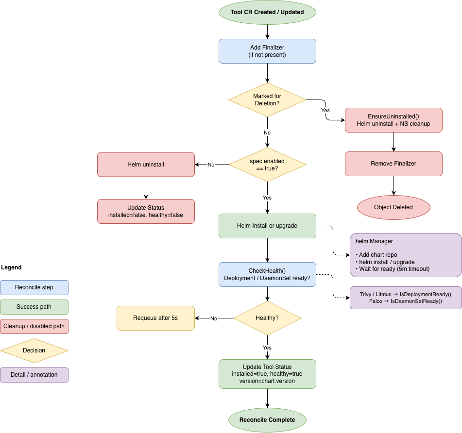

# Chapter 3A: Practical Implementation — CRDs, Reconcilers, and the Unified Interface

---

## 3.1 The CRD-Centric Design Philosophy

The central architectural claim of Eirenyx is that three fundamentally different security and resilience tools — a
vulnerability scanner, a runtime threat detector, and a chaos engineering framework — can be operated through a single,
coherent declarative interface without sacrificing the configurability of any individual tool. The mechanism that makes
this claim concrete is the Custom Resource Definition.

Kubernetes CRDs allow arbitrary domain concepts to be expressed as first-class API objects. Once a CRD is registered,
the Kubernetes API server treats it identically to built-in resources: it is stored in etcd, subject to RBAC, watchable
by controllers, and addressable by `kubectl`. Eirenyx uses this extensibility to define its own resource vocabulary —
`Tool`, `Policy`, and `PolicyReport` — that abstracts over the heterogeneous APIs of Trivy, Falco, and LitmusChaos.

The result is a design where a platform engineer who wants to run a Trivy vulnerability scan, configure a Falco
detection rule, or launch a Litmus chaos experiment writes the same kind of Kubernetes manifest in each case. The API
surface, the deployment workflow, the status reporting, and the audit trail are uniform. Only the tool-specific
sub-specification differs.

This section describes the three CRDs and the operator machinery — the reconcilers and the factory pattern — that
translate declarative intent into running tool behaviour.

---

## 3.2 The Three-CRD Data Model

The Eirenyx data model is a strict three-level hierarchy:

```
Tool  ←owns→  Policy  ←owns→  PolicyReport
```

Each level corresponds to a distinct operational concern:

| CRD            | Responsibility                                                | Created by           |
|----------------|---------------------------------------------------------------|----------------------|
| `Tool`         | Declares that a security tool should be installed and running | Platform engineer    |
| `Policy`       | Declares what that tool should do                             | Security engineer    |
| `PolicyReport` | Records what the tool found                                   | Operator (automatic) |

The ownership relationships are encoded as Kubernetes owner references. When a `Tool` is deleted, Kubernetes
automatically garbage-collects all associated `Policy` objects, which in turn triggers deletion of all associated
`PolicyReport` objects. No custom cleanup logic is required for this cascade; it is a built-in property of the
Kubernetes garbage collector.

### 3.2.1 The `Tool` CRD — The Installation Declaration

A `Tool` resource is a declaration of intent: *this security tool should be installed, in this namespace, with this
configuration*. It maps one-to-one with a Helm chart release.

```yaml
apiVersion: eirenyx.io/v1alpha1
kind: Tool
metadata:
  name: trivy
  namespace: eirenyx-system
spec:
  type: trivy
  enabled: true
  namespace: trivy-system
  values:
    trivy:
      resources:
        requests:
          memory: "256Mi"
```

The `spec.type` field is a closed enumeration with three valid values: `trivy`, `falco`, and `litmus`. It is the primary
discriminator — the value that the factory uses to select the correct service implementation at runtime. Kubebuilder
enforces this constraint at the API server level via OpenAPI validation:

```go
// +kubebuilder:validation:Enum=trivy;falco;litmus
type ToolType string
```

`spec.enabled` is the operational control knob. Setting it to `false` does not delete the `Tool` object. Instead, the
`ToolReconciler` detects the state change and triggers an orderly Helm uninstall of the chart. This is a deliberate
design decision: the object acts as a persistent record of intent, not merely a trigger for a one-time action. A
platform engineer can disable a tool temporarily, observe the effect, and re-enable it — all without losing the
configuration. The history is preserved in etcd and visible in the Kubernetes audit log.

`spec.values` is a `runtime.RawExtension` — an opaque JSON blob that is passed verbatim as Helm values during install or
upgrade. This field deliberately has no schema: Eirenyx imposes no constraints on chart-level configuration. Any option
exposed by the upstream Helm chart (Trivy's resource limits, Falco's driver selection, Litmus's RBAC configuration) can
be set here without requiring changes to the Eirenyx CRD schema.

The status subresource reflects the observed state:

```go
type ToolStatus struct {
    Installed  bool               `json:"installed,omitempty"`
    Healthy    bool               `json:"healthy,omitempty"`
    Version    string             `json:"version,omitempty"`
    Conditions []metav1.Condition `json:"conditions,omitempty"`
}
```

`Installed` indicates whether the Helm release exists. `Healthy` indicates whether the tool's workload has reached a
ready state — for Trivy and Litmus, a `Deployment` with sufficient ready replicas; for Falco, a `DaemonSet` scheduled on
all eligible nodes. The `Conditions` slice follows the `metav1.Condition` standard, enabling
`kubectl wait --for=condition=Ready` and enabling GitOps health assessment tools to observe tool readiness through the
same mechanisms they use for native Kubernetes resources.

A finalizer — `eirenyx.tool/finalizer` — is registered on every `Tool` object. The finalizer prevents Kubernetes from
removing the object from etcd until the operator has successfully executed the Helm uninstall. Without the finalizer, a
user could delete a `Tool` object and leave an orphaned Helm release consuming cluster resources indefinitely.

### 3.2.2 The `Policy` CRD — The Behaviour Declaration

A `Policy` resource answers a different question from `Tool`. Where `Tool` says *install this software*, `Policy` says
*configure it to do this*. A Trivy policy tells the installed Trivy instance what namespace to scan. A Falco policy
tells the installed Falco instance which detection rules to activate. A Litmus policy tells the installed Litmus
instance which chaos experiments to run.

The spec is a discriminated union. The `type` field is the discriminator; the three optional sub-spec fields hold the
tool-specific configuration:

```go
type PolicySpec struct {
    Type    PolicyType        `json:"type"`
    Enabled bool              `json:"enabled"`
    Target  PolicyTarget      `json:"target,omitempty"`
    Falco   *FalcoPolicySpec  `json:"falco,omitempty"`
    Trivy   *TrivyPolicySpec  `json:"trivy,omitempty"`
    Litmus  *LitmusPolicySpec `json:"litmus,omitempty"`
}
```

At most one of `Falco`, `Trivy`, or `Litmus` will be non-nil. The `PolicyReconciler` validates this constraint and
rejects policies that set the wrong sub-spec for their declared type. This validation runs before any Kubernetes API
calls, returning a terminal error immediately rather than creating partially-valid objects in the cluster.

From a platform engineer's perspective, three policies for three different tools look structurally identical at the top
level:

```yaml
# A Trivy scanning policy
apiVersion: eirenyx.io/v1alpha1
kind: Policy
metadata:
  name: scan-production
spec:
  type: trivy
  enabled: true
  trivy:
    namespace: production
    severity: CRITICAL,HIGH

---
# A Falco detection policy
apiVersion: eirenyx.io/v1alpha1
kind: Policy
metadata:
  name: detect-shell-spawn
spec:
  type: falco
  enabled: true
  falco:
    ruleRef: terminal-shell-in-container

---
# A Litmus resilience policy
apiVersion: eirenyx.io/v1alpha1
kind: Policy
metadata:
  name: pod-resilience
spec:
  type: litmus
  enabled: true
  litmus:
    experiments:
      - name: pod-delete-test
        experimentRef: pod-delete
        appInfo:
          appNamespace: production
          appLabel: "app=my-api"
          appKind: deployment
```

The consistent structure — `apiVersion`, `kind`, `metadata`, `spec.type`, `spec.enabled`, tool sub-spec — is the single
interface that chapter 1.7 identified as a requirement. A team that already knows how to create one kind of policy knows
the structure of all three.

The `Policy` status tracks the reconciliation lifecycle:

```go
type PolicyStatus struct {
    Phase       string             `json:"phase,omitempty"`
    Conditions  []metav1.Condition `json:"conditions,omitempty"`
    LastReport  string             `json:"lastReport,omitempty"`
    ObservedGen int64              `json:"observedGeneration,omitempty"`
}
```

`ObservedGeneration` is the field that enables change detection. Every time a `Policy` object is updated, Kubernetes
increments its `metadata.generation`. The reconciler compares this value against `status.observedGeneration`; a mismatch
signals that the specification has changed and that any existing report is stale and must be re-run. This mechanism
prevents cached results from persisting after a policy is updated.

### 3.2.3 The `PolicyReport` CRD — The Result Record

`PolicyReport` is the third CRD and it is unique: platform engineers never create it directly. The `PolicyReconciler`
creates one `PolicyReport` per `Policy` automatically. The `PolicyReportReconciler` then fills it with findings.

Its specification is minimal by design — it records only what is needed to correlate the report with its source:

```go
type PolicyReportSpec struct {
    PolicyRef PolicyReference `json:"policyRef"`
    Type      PolicyType      `json:"type"`
}

type PolicyReference struct {
    Name       string `json:"name"`
    Generation int64  `json:"generation"`
}
```

`PolicyReference.Generation` is the key field. When a `Policy` is updated and its `metadata.generation` increments, the
`PolicyReconciler` detects the mismatch between the policy's current generation and the value stored in
`PolicyReport.Spec.PolicyRef.Generation`. It resets the report to the `Pending` phase and clears its status. This forces
the `PolicyReportReconciler` to re-execute the scan and overwrite the stale findings with current data.

The status subresource carries the full result:

```go
type PolicyReportStatus struct {
    Phase   ReportPhase          `json:"phase,omitempty"`
    Summary ReportSummary        `json:"summary,omitempty"`
    Details runtime.RawExtension `json:"details,omitempty"`
}

type ReportSummary struct {
    Verdict     Verdict `json:"verdict,omitempty"`
    TotalChecks int32   `json:"totalChecks,omitempty"`
    Passed      int32   `json:"passed,omitempty"`
    Failed      int32   `json:"failed,omitempty"`
}
```

`Phase` is a progression through `Pending → Running → Completed` (or `Failed`). `Verdict` is a binary `Pass`/`Fail`
computed by each tool's report handler. The verdict criteria differ by tool:

- **Trivy**: `Fail` if any finding meets or exceeds the configured minimum severity threshold (default: `CRITICAL`).
- **Falco**: `Fail` if any runtime security alerts are present in the observation window.
- **Litmus**: `Pass` if all configured chaos experiments were successfully scheduled (the act of scheduling is the
  deliverable; `ChaosResult` interpretation is a planned extension).

`Details` is a `runtime.RawExtension` — an opaque JSON blob. Each tool handler writes its own structured payload: a list
of CVEs for Trivy, a list of runtime events for Falco, a chaos experiment summary for Litmus. The `PolicyReport` schema
does not need to enumerate every possible finding shape; the REST API and UI consume this field as-is. This design
allows tool-specific richness in the findings data without coupling the CRD schema to any particular tool's output
format.

---

## 3.3 The Ownership Hierarchy and Cascading Lifecycle

The owner reference relationships between the three CRDs are not merely a naming convention — they encode the entire
lifecycle policy of the system.

```
Tool (owner)
  └── Policy (owned by Tool, owns PolicyReport)
        └── PolicyReport (owned by Policy)
```

When a `Tool` is deleted:

1. Kubernetes marks all `Policy` objects with `ownerReference → Tool` for deletion.
2. Each `Policy` deletion triggers Kubernetes to mark its `PolicyReport` for deletion.
3. The `ToolReconciler` finalizer runs `EnsureUninstalled` before the `Tool` is removed from etcd.
4. The `PolicyReconciler` finalizer runs `Cleanup` on the engine, removing tool-specific objects (`Job`, `ConfigMap`,
   `ChaosEngine`).
5. Once all owned objects are gone, the parent is removed.

This cascade eliminates an entire class of resource leaks. Without owner references, a deleted `Tool` could leave behind
orphaned `Policy` objects that reference a non-existent installation, and those policies could leave behind stale
`PolicyReport` objects with findings that no longer reflect the current cluster state. The ownership model prevents this
by construction.

The owner reference for `Policy → Tool` is established lazily by the `PolicyReconciler` on first reconcile:

```go
has, err := controllerutil.HasOwnerReference(policy.OwnerReferences, &tool, r.Scheme)
if !has {
    controllerutil.SetOwnerReference(&tool, &policy, r.Scheme)
    r.Update(ctx, &policy)
    return Complete()
}
```

Lazy establishment is necessary because `Tool` and `Policy` objects may be created independently — for example, when
applying a GitOps repository where manifests are applied in alphabetical order. The operator does not require that a
`Tool` exist before its `Policy` is created; it simply waits and retries until the referenced `Tool` is available.

---

## 3.4 The Tool Reconciler

The `ToolReconciler` is the operator loop for the `Tool` CRD. Its `Reconcile` method is invoked by controller-runtime
whenever a `Tool` resource is created, updated, deleted, or when a requeue request fires. It drives the tool's Helm
lifecycle to match the desired state expressed in `spec`.

### 3.4.1 Reconciliation Flow

The reconciler follows a strict seven-step linear flow:

**Step 1 — Fetch.** The reconciler retrieves the `Tool` object by its `NamespacedName`. If the object is not found (
deleted before the reconciler ran), `client.IgnoreNotFound` absorbs the error and reconciliation ends silently.

**Step 2 — Deletion handling.** If `DeletionTimestamp` is set, the object is being deleted. The reconciler calls
`EnsureUninstalled` and, on success, removes the finalizer. This ensures the Helm release is always removed before the
`Tool` object leaves etcd.

**Step 3 — Finalizer registration.** If the finalizer is absent, it is added via a strategic merge patch. A patch is
used rather than a full update to avoid overwriting concurrent status changes.

**Step 4 — Service instantiation.** The factory function `NewToolService` is called with the `Tool` spec. It returns the
correct `ToolService` implementation (`TrivyService`, `FalcoService`, or `LitmusService`). If the type is unrecognised,
a `Ready=False` condition is written and reconciliation stops.

**Step 5 — Install or uninstall.** The reconciler branches on `spec.enabled`. If `true`, `EnsureInstalled` runs the Helm
install or upgrade and waits up to five minutes for the workload to reach a ready state. If `false`, `EnsureUninstalled`
runs Helm uninstall if the release exists.

**Step 6 — Health check.** `CheckHealth` inspects the underlying Kubernetes workload. For Trivy and Litmus, it verifies
the ready replica count of a `Deployment`. For Falco, it checks a `DaemonSet`'s `numberReady` against
`desiredNumberScheduled`. If the workload is not yet ready, the reconciler requeues after five seconds.

**Step 7 — Status update.** The observed state (`installed`, `healthy`) is written to the status subresource. If the
tool is not healthy, a final requeue prevents the controller from going idle while the workload is starting.

```go
if tool.Spec.Enabled {
    if err := svc.EnsureInstalled(ctx, &tool); err != nil {
        return RequeueAfter(5 * time.Second)
    }
} else {
    if err := svc.EnsureUninstalled(ctx, &tool); err != nil {
        return RequeueAfter(5 * time.Second)
    }
}

healthy, err := svc.CheckHealth(ctx, &tool)
if !healthy {
    return RequeueAfter(5 * time.Second)
}
```

The helper functions `Complete()`, `CompleteWithError()`, and `RequeueAfter()` are thin wrappers around `ctrl.Result`,
keeping the business logic free of framework boilerplate.



---

## 3.5 The Policy Reconciler

The `PolicyReconciler` coordinates three concerns simultaneously: tool availability, policy execution, and report
generation. It is triggered whenever a `Policy` object changes.

### 3.5.1 Owner Reference Binding

The first action of the `PolicyReconciler` is to look up the `Tool` object that this policy belongs to. The lookup uses
a naming convention: a policy of `spec.type: trivy` expects a `Tool` named `trivy` in the same namespace. If the tool is
not found or is not healthy, the reconciler requeues and waits — a policy cannot be executed against a tool that is not
installed.

Once the tool is found, the owner reference is established if absent:

```go
has, err := controllerutil.HasOwnerReference(policy.OwnerReferences, &tool, r.Scheme)
if !has {
    controllerutil.SetOwnerReference(&tool, &policy, r.Scheme)
    r.Update(ctx, &policy)
    return Complete()
}
```

### 3.5.2 Policy Execution

With ownership established and the policy enabled, execution is delegated to the `policy.Engine` returned by the
factory:

```go
engine, err := NewPolicyEngine(&policy, deps)
engine.Validate(&policy)
engine.Reconcile(ctx, &policy)
```

`Validate` checks structural correctness before any cluster state is touched. Validation errors are terminal — they
represent user errors that retrying will not fix, so they are written as a `Failed` condition and reconciliation stops.

`Reconcile` performs the tool-specific action: creating a Kubernetes `Job` for Trivy, writing a `ConfigMap` for Falco,
or creating a `ChaosEngine` CRD for Litmus.

### 3.5.3 Report Generation and Staleness Detection

After execution, the reconciler calls `engine.GenerateReport`, which creates or resets the `PolicyReport`:

```go
report, err := engine.GenerateReport(ctx, &policy)
needsRescan := report.Spec.PolicyRef.Generation != policy.Generation

controllerutil.CreateOrUpdate(ctx, r.Client, report, func() error {
    report.Spec.PolicyRef.Generation = policy.Generation
    report.Spec.Type = policy.Spec.Type
    return nil
})

if needsRescan {
    report.Status.Phase = eirenyx.ReportPending
    report.Status.Summary = eirenyx.ReportSummary{}
    report.Status.Details = runtime.RawExtension{}
    r.Status().Update(ctx, report)
}
```

If the policy's generation has incremented (the spec was changed), the report is reset to `Pending`. This triggers the
`PolicyReportReconciler` to re-run the scan and produce a fresh result. Without this mechanism, a stale `Completed`
report would persist indefinitely after a policy was reconfigured.

---

## 3.6 The PolicyReport Reconciler

The `PolicyReportReconciler` is a narrowly scoped controller with a single purpose: drive a `PolicyReport` in the
`Pending` or `Running` phase to `Completed`. It is deliberately separate from the `PolicyReconciler` to uphold single
responsibility — the policy controller manages the lifecycle and triggers scans; the report controller executes scans
and records findings.

Two guard clauses protect against redundant work:

```go
// Already done — do not re-run
if policyReport.Status.Phase == eirenyx.ReportCompleted {
    return Complete()
}

// Owner is gone — clean up the orphan
if apierrors.IsNotFound(err) {
    r.Delete(ctx, &policyReport)
    return Complete()
}
```

Execution is delegated to the `report.Handler` from the factory:

```go
handler, err := NewReportEngine(&policyReport, deps)
handler.Reconcile(ctx, &policyReport)
```

The `Handler` interface is intentionally minimal — a single `Reconcile` method. Each implementation is free to perform
multiple Kubernetes API calls, wait for `Job` completion, or query tool-specific CRDs. The interface boundary keeps this
complexity out of the controller. The controller never needs to know whether it is reading Trivy `VulnerabilityReport`
CRDs, counting Falco alert events, or inspecting Litmus `ChaosResult` objects.

---

## 3.7 The Factory Pattern and Core Interfaces

The factory pattern is the mechanism that transforms the three homogeneous reconcilers into a system that handles three
heterogeneous tools. The controllers contain zero conditional logic based on tool type. All branching is encapsulated in
three factory functions in `internal/factory/factory.go`.

### 3.7.1 The Factory Functions

```go
type Dependencies struct {
    Client    client.Client
    Scheme    *runtime.Scheme
    K8sClient *k8s.Client
}

func NewToolService(tool *eirenyx.Tool, deps Dependencies) (tools.ToolService, error)
func NewPolicyEngine(p *eirenyx.Policy, deps Dependencies) (policy.Engine, error)
func NewReportEngine(r *eirenyx.PolicyReport, deps Dependencies) (report.Handler, error)
```

The `Dependencies` struct is a lightweight dependency injection container. It carries the controller-runtime
`client.Client` (for Kubernetes API access), the runtime `Scheme` (for owner reference resolution and type
registration), and an optional low-level `k8s.Client`. Passing dependencies explicitly rather than relying on global
state makes each factory function independently testable.

The switch statements inside the factory functions are the **only** location in the entire codebase where `ToolType` or
`PolicyType` values are enumerated:

```go
func NewToolService(tool *eirenyx.Tool, deps Dependencies) (tools.ToolService, error) {
    switch tool.Spec.Type {
    case eirenyx.ToolFalco:
        return &tools.FalcoService{K8sClient: deps.K8sClient}, nil
    case eirenyx.ToolLitmus:
        return &tools.LitmusService{K8sClient: deps.K8sClient}, nil
    case eirenyx.ToolTrivy:
        return &tools.TrivyService{K8sClient: deps.K8sClient}, nil
    default:
        return nil, fmt.Errorf("unsupported tool type: %s", tool.Spec.Type)
    }
}
```

The architectural consequence is significant: **adding support for a new tool requires three additions**:

1. A new constant in `api/v1alpha1` (e.g., `ToolFoo ToolType = "foo"`).
2. A new implementation struct in the appropriate `internal/` package (e.g., `FooService`, `FooPolicyEngine`,
   `FooReportHandler`).
3. A new `case` in each of the three factory functions.

No existing controller code needs to change. The `ToolReconciler`, `PolicyReconciler`, and `PolicyReportReconciler` are
entirely unaware that a new tool has been added. The system is open for extension and closed for modification — a direct
realisation of the open-closed principle applied at the Kubernetes operator level.

### 3.7.2 The `ToolService` Interface

```go
type ToolService interface {
    Name() string
    EnsureInstalled(ctx context.Context, tool *eirenyx.Tool) error
    EnsureUninstalled(ctx context.Context, tool *eirenyx.Tool) error
    CheckHealth(ctx context.Context, tool *eirenyx.Tool) (bool, error)
}
```

`ToolService` defines the installation lifecycle contract. All four methods operate on the `Tool` CRD object, giving
implementations full access to the spec (including `Values` for Helm configuration). `EnsureInstalled` and
`EnsureUninstalled` are idempotent by contract: they can be called any number of times without producing unintended side
effects. This is essential for operators, where the same reconcile function may fire repeatedly before the system
reaches steady state.

Each concrete implementation — `TrivyService`, `FalcoService`, `LitmusService` — uses the Helm Go SDK internally. The
repository is added programmatically, the chart is installed or upgraded via the Helm action API, and the call blocks
until the release reports a `deployed` status or a five-minute timeout elapses. No `helm` binary is required in the
operator container image.

### 3.7.3 The `Engine` Interface

```go
type Engine interface {
    Validate(policy *eirenyx.Policy) error
    Reconcile(ctx context.Context, policy *eirenyx.Policy) error
    Cleanup(ctx context.Context, policy *eirenyx.Policy) error
    GenerateReport(ctx context.Context, policy *eirenyx.Policy) (*eirenyx.PolicyReport, error)
}
```

`Engine` defines the policy execution contract. The four methods map to four distinct stages of a policy's lifecycle:

- `Validate` — synchronous, stateless structural validation of the spec. Runs before any cluster interaction.
- `Reconcile` — creates or updates the Kubernetes objects required for policy execution (a `Job`, a `ConfigMap`, a
  `ChaosEngine`).
- `Cleanup` — removes those objects when the policy is disabled or deleted.
- `GenerateReport` — constructs a `PolicyReport` in the `Pending` phase, correctly linked to the policy.

### 3.7.4 The `Handler` Interface

```go
type Handler interface {
    Reconcile(ctx context.Context, policyReport *eirenyx.PolicyReport) error
}
```

`Handler` is the simplest of the three interfaces. Its single `Reconcile` method drives a `PolicyReport` to a terminal
state. The deliberate asymmetry between `Engine` (four methods, creates work) and `Handler` (one method, reads results)
reflects the different timing and state management requirements of initiating a scan versus reading its outcome. A Trivy
job may take several minutes; a Falco alert query is immediate. Separating these into two interfaces with two dedicated
reconcilers allows each to operate at its own pace without blocking the other.

### 3.7.5 The Unified Interface in Practice

The factory pattern, combined with the three-CRD data model, produces a system where the complexity of three different
security tools is entirely hidden behind a uniform Kubernetes API. The following diagram illustrates the relationship:

```
kubectl apply -f tool.yaml        # User creates Tool
       ↓
ToolReconciler → NewToolService(type)
       ↓
TrivyService / FalcoService / LitmusService
       ↓ (Helm SDK)
Trivy DaemonSet / Falco DaemonSet / Litmus Operator installed

kubectl apply -f policy.yaml      # User creates Policy
       ↓
PolicyReconciler → NewPolicyEngine(type)
       ↓
TrivyEngine / FalcoEngine / LitmusEngine
       ↓ (K8s API)
Scan Job / Rule ConfigMap / ChaosEngine created

PolicyReportReconciler → NewReportHandler(type)
       ↓
TrivyReportHandler / FalcoReportHandler / LitmusReportHandler
       ↓
PolicyReport.status populated with findings and verdict
```

At every step, the controller layer is identical. Only the implementation layer varies — and that variation is invisible
to the platform engineer interacting with the system through `kubectl` or the Eirenyx dashboard.

---

*Previous: [Chapter 2 — Architecture and Technologies](02-architecture.md)*
*Next: [Chapter 3B — Trivy Integration](03b-trivy.md)*
