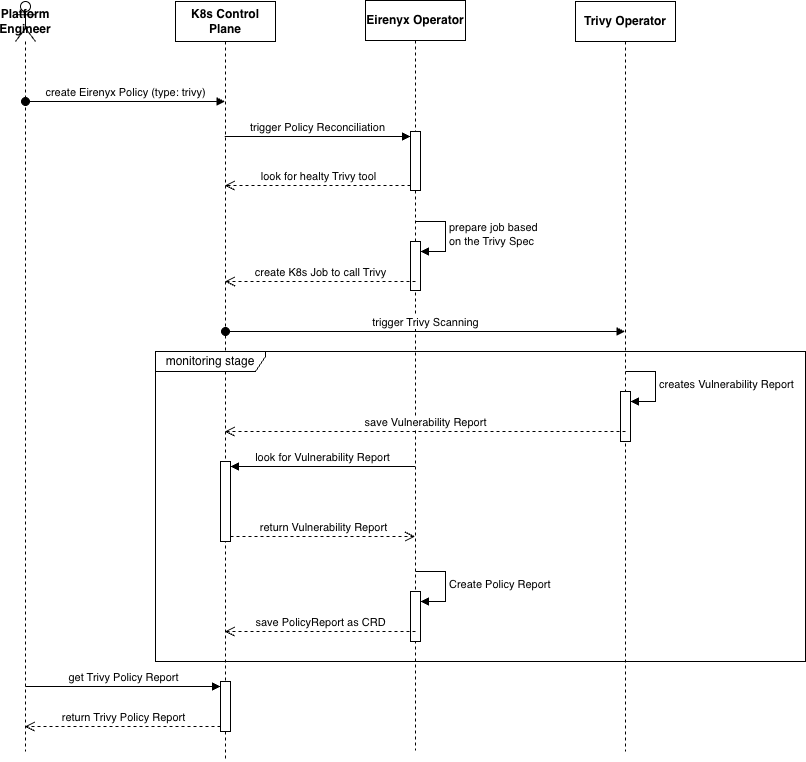

# Chapter 3B: Practical Implementation — Trivy Integration

---

## 3.6 Trivy Integration

### 3.6.1 Purpose and Role in Eirenyx

Trivy is a comprehensive open-source vulnerability and misconfiguration scanner developed by Aqua Security. In the
context of Eirenyx, Trivy fills the **pre-runtime security role**: it analyses container images for known CVEs (Common
Vulnerabilities and Exposures) before or during deployment, providing a verdict on whether a workload's dependencies
contain dangerous vulnerabilities.

The operational problem Trivy solves within Eirenyx is significant: a Kubernetes cluster running hundreds of services
may pull images from multiple registries, at different patch levels, with different base images. Without a centralised
scanning policy, it falls to individual teams to run Trivy manually, parse its output, and act on findings — if they
remember to do so at all. Eirenyx automates this by expressing scan intentions as Kubernetes objects, executing them as
in-cluster jobs, and surfacing findings as structured, queryable `PolicyReport` resources.

Trivy is not re-implemented inside Eirenyx. It is installed as a Helm chart (the `trivy-operator` distribution from Aqua
Security) and runs as a cluster-resident DaemonSet. Eirenyx acts as a policy layer on top: it triggers scans, tracks
their status, and aggregates their results into the unified report model.

### 3.6.2 How Trivy Works in the Cluster

When a Trivy `Tool` resource is created and enabled, the `ToolReconciler` installs the `trivy-operator` Helm chart into
the specified namespace (typically `trivy-system`). The trivy-operator deploys a controller that watches for specific
trigger objects — in the Eirenyx integration, Kubernetes `batch/v1 Job` resources — and produces `VulnerabilityReport`
CRDs as output.

The integration flow is:

```
Policy (type: trivy) → ToolReconciler → Helm install (trivy-operator)
                                              ↓
PolicyReconciler → trivy.Engine → Kubernetes Job (trivy image scan)
                                              ↓
trivy-operator picks up Job → runs scan → writes VulnerabilityReport CRD
                                              ↓
PolicyReportReconciler → TrivyReportHandler → reads VulnerabilityReport → writes PolicyReport
```

Each stage is driven by a different controller, allowing the system to proceed asynchronously. The `PolicyReconciler`
does not wait for the scan to finish; it creates the job and moves on. The `PolicyReportReconciler` polls until findings
are available.

### 3.6.3 The Trivy Policy Specification

A platform engineer expresses a Trivy scan through the `spec.trivy` field of a `Policy` resource. The sub-specification
holds a list of named scans, each targeting a specific container image:

```yaml
apiVersion: eirenyx.io/v1alpha1
kind: Policy
metadata:
  name: api-image-scan
  namespace: eirenyx-system
spec:
  type: trivy
  enabled: true
  trivy:
    scans:
      - name: api
        image: myregistry/my-api:v1.2.3
        severity: "CRITICAL,HIGH"
        ignoreUnfixed: true
      - name: sidecar
        image: myregistry/my-sidecar:v2.0.0
        severity: "CRITICAL"
```

Each scan entry carries:

| Field           | Purpose                                                                                              |
|-----------------|------------------------------------------------------------------------------------------------------|
| `name`          | Identifier for this scan within the policy; used to correlate the job with its `VulnerabilityReport` |
| `image`         | The fully qualified image reference to scan                                                          |
| `severity`      | Comma-separated list of severity levels to include (maps to `--severity`)                            |
| `ignoreUnfixed` | When `true`, suppresses CVEs with no upstream fix available (maps to `--ignore-unfixed`)             |

The severity filter maps directly to the Trivy CLI flag `--severity`, so platform engineers use the same vocabulary they
would use when running Trivy manually. The operator requires no knowledge of Trivy's internal severity model — it passes
the value through verbatim.

`Validate` performs structural checks before any Kubernetes objects are created: it confirms that `spec.trivy` is
non-nil, that at least one scan is defined, and that each scan entry has a non-empty `name` and `image`. These are
terminal validation errors — the reconciler does not requeue on failure, as retrying cannot fix a structural
specification error.

### 3.6.4 The Trivy Engine — Creating Kubernetes Jobs

`trivy.Engine.Reconcile` creates one Kubernetes `batch/v1 Job` per scan entry. The job name is derived deterministically
from the policy name and scan name:

```go
func getScanJobName(policy *eirenyx.Policy, scanName string) string {
    return fmt.Sprintf("eirenyx-trivy-%s-%s", policy.Name, scanName)
}
```

Deterministic naming is essential for idempotency: the reconciler checks for an existing job before creating a new one.
If the job already exists (the reconciler was re-triggered before the previous scan completed), the engine leaves it
unchanged rather than deleting and recreating it. This prevents unnecessary scan re-runs and avoids a race condition
where a scan result is discarded mid-flight.

The job is configured with specific parameters that reflect deliberate design choices:

```go
&batchv1.Job{
    ObjectMeta: metav1.ObjectMeta{
        Name:      getScanJobName(policy, scan.Name),
        Namespace: policy.Namespace,
        Labels: map[string]string{
            "app.kubernetes.io/managed-by":    "eirenyx",
            "eirenyx.eirenyx/policy-name":     policy.Name,
            "eirenyx.eirenyx/policy-type":     string(policy.Spec.Type),
            "eirenyx.eirenyx/trivy-scan-name": scan.Name,
        },
        OwnerReferences: []metav1.OwnerReference{
            *metav1.NewControllerRef(policy, policy.GroupVersionKind()),
        },
    },
    Spec: batchv1.JobSpec{
        BackoffLimit:            ptr(int32(0)),
        TTLSecondsAfterFinished: ptr(int32(1800)),
        Template: corev1.PodTemplateSpec{
            Spec: corev1.PodSpec{
                RestartPolicy: corev1.RestartPolicyNever,
                Containers: []corev1.Container{{
                    Name:  "trivy",
                    Image: "aquasec/trivy:latest",
                    Args:  buildTrivyArgs(scan),
                }},
            },
        },
    },
}
```

Key design choices:

- **`BackoffLimit: 0`** — No retries on container failure. A failed scan is reported as a failure rather than retried
  silently, making errors visible to the platform engineer immediately.
- **`TTLSecondsAfterFinished: 1800`** — The job and its pods are automatically garbage-collected 30 minutes after
  completion. This prevents accumulation of completed job objects in the cluster without requiring manual cleanup.
- **`RestartPolicy: Never`** — The pod is not restarted if Trivy exits with a non-zero code. Combined with
  `BackoffLimit: 0`, this produces a single deterministic scan attempt per job.
- **Owner reference on the job** — When the policy is deleted or its `Cleanup` method is called, the job is
  automatically removed along with any associated pods.

The Trivy container's command arguments are assembled dynamically from the scan spec:

```go
func buildTrivyArgs(scan eirenyx.TrivyScan) []string {
    args := []string{"image", "--format", "json", "--quiet"}
    if scan.Severity != "" {
        args = append(args, "--severity", scan.Severity)
    }
    if scan.IgnoreUnfixed {
        args = append(args, "--ignore-unfixed")
    }
    args = append(args, scan.Image)
    return args
}
```

The resulting command is equivalent to:

```shell
trivy image --format json --quiet --severity CRITICAL,HIGH --ignore-unfixed myregistry/my-api:v1.2.3
```

Trivy writes its JSON output to stdout. The trivy-operator controller running in the cluster intercepts the pod's output
and persists the structured findings as a `VulnerabilityReport` CRD in the same namespace. This is the handoff point
between the Trivy engine (which creates the job) and the Trivy report handler (which reads the results).

### 3.6.5 The Trivy Report Handler — Why Reports Are Necessary

The `TrivyReportHandler` is the consumer side of the Trivy integration. Understanding why it exists as a separate
component is essential to understanding the Eirenyx architecture.

The operator cannot know in advance how long a Trivy scan will take. A large image with many layers may take several
minutes; a small distroless image may scan in seconds. If the `PolicyReconciler` waited synchronously for scan
completion, it would block for an unpredictable duration and hold a reconciliation goroutine hostage. Instead, the
system is split: the `PolicyReconciler` creates the job and moves on; the `PolicyReportReconciler` continuously polls
until results are available.

The `TrivyReportHandler` is instantiated by the factory and called by the `PolicyReportReconciler`:

```go
handler, err := factory.NewReportEngine(&policyReport, deps)
handler.Reconcile(ctx, &policyReport)
```

The handler's `Reconcile` method follows a clear sequence:

**Step 1 — List VulnerabilityReports.** The handler queries all `VulnerabilityReport` CRDs in the policy's namespace
that were produced by the trivy-operator for `Job` resources:

```go
h.Client.List(ctx, &vulnReports,
    client.InNamespace(policyReport.Namespace),
    client.MatchingLabels{"trivy-operator.resource.kind": "Job"},
)
```

**Step 2 — Correlate by job name.** The handler filters this list to find only the reports whose
`trivy-operator.resource.name` label matches one of the job names created by the engine:

```go
expectedJobName := fmt.Sprintf("eirenyx-trivy-%s-%s", policy.Name, scan.Name)
for _, vr := range vulnReports.Items {
    if vr.Labels["trivy-operator.resource.name"] == expectedJobName {
        relevantReports = append(relevantReports, vr)
    }
}
```

This label-based correlation is the bridge between the job created by Eirenyx and the report created by the
trivy-operator. The trivy-operator automatically propagates the job name into the `VulnerabilityReport` labels, making
this lookup reliable.

**Step 3 — Poll if not ready.** If no relevant `VulnerabilityReport` objects are found, the scan is still running. The
handler sets the report phase to `Running` and returns a non-nil error, causing the `PolicyReportReconciler` to requeue
after five seconds:

```go
if len(relevantReports) == 0 {
    policyReport.Status.Phase = eirenyx.ReportRunning
    r.Status().Update(ctx, &policyReport)
    return fmt.Errorf("no VulnerabilityReports available yet for policy %s", policy.Name)
}
```

This polling loop is a deliberate design choice over push-based notification. Push-based approaches (watching for new
`VulnerabilityReport` objects) require additional watcher configuration and are more complex to reason about. The
polling interval (five seconds) is short enough to be responsive but long enough to avoid excessive API server load.

**Step 4 — Aggregate findings.** Once results are available, the handler aggregates across all scan targets:

```go
for _, vr := range relevantReports {
    summary := vr.Report.Summary
    total += int32(summary.CriticalCount + summary.HighCount + summary.MediumCount + summary.LowCount)
    failed += int32(summary.CriticalCount + summary.HighCount)
    allVulns = append(allVulns, vr.Report.Vulnerabilities...)
}
```

**Step 5 — Compute verdict.** The verdict follows a clear, documented rule: any finding at `CRITICAL` or `HIGH` severity
causes a `Fail` verdict. `MEDIUM` and `LOW` findings contribute to the total count but do not affect the verdict. This
reflects the industry standard where lower-severity findings are informational — they require attention but do not
represent an immediate security posture failure.

```go
verdict := eirenyx.VerdictPass
if failed > 0 {
    verdict = eirenyx.VerdictFail
}
```

**Step 6 — Write the report.** The final status is written in a single `Status().Update` call:

```go
policyReport.Status.Phase   = eirenyx.ReportCompleted
policyReport.Status.Summary = eirenyx.ReportSummary{
    Verdict:     verdict,
    TotalChecks: total,
    Passed:      total - failed,
    Failed:      failed,
}
policyReport.Status.Details = runtime.RawExtension{Raw: detailsBytes}
```

The `Details` field contains a JSON payload with the full vulnerability list and the scanned image reference. This makes
the raw findings available for display in the Eirenyx web dashboard without additional API calls to the trivy-operator's
CRDs.

### 3.6.6 Why the Report Architecture Matters

The separation between the `trivy.Engine` (which creates jobs) and the `TrivyReportHandler` (which reads results) is not
merely an organisational convention — it reflects the temporal structure of the scan lifecycle.

A Trivy scan has three distinct phases: *initiation* (creating the job), *execution* (the job running in the cluster),
and *observation* (reading the completed results). These phases happen at different times and may be interrupted at any
point. A cluster restart between initiation and observation should not cause a re-scan; the existing job should be
picked up and its results read. The separate reconciler with its guard clause (`if phase == Completed: return`) ensures
this: once a report reaches `Completed`, it is immutable until the policy generation changes.

This design also means that `PolicyReport` objects serve as a permanent record of security findings at a specific point
in time — a property that is valuable for audit and compliance purposes.



---

*Previous: [Chapter 3A — CRDs, Reconcilers, Factory Pattern](03a-operator-crds.md)*
*Next: [Chapter 3C — Falco Integration](03c-falco.md)*
