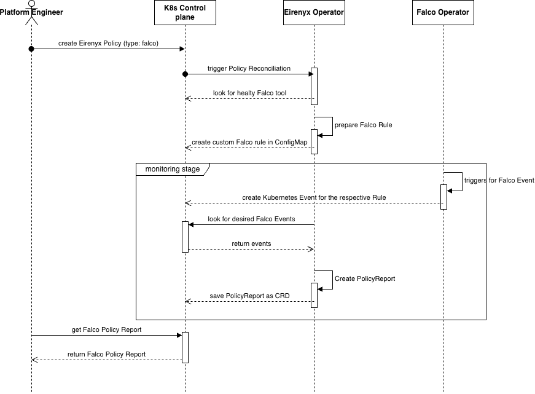

# Chapter 3C: Practical Implementation — Falco Integration

---

## 3.7 Falco Integration

### 3.7.1 Purpose and Role in Eirenyx

Falco is a cloud-native runtime security tool developed by the Cloud Native Computing Foundation (CNCF). It detects
anomalous and potentially malicious behaviour inside running containers by hooking into the Linux kernel — either via
eBPF probes or a kernel module — and evaluating a rule engine against the continuous stream of system calls generated by
every process in the cluster.

Where Trivy answers the question *"does this image contain known vulnerabilities?"*, Falco answers a fundamentally
different question: *"is something behaving suspiciously right now?"*. These two tools are complementary, not redundant.
A container image may be entirely free of known CVEs and still execute a malicious payload at runtime — for example, by
downloading and executing a binary after deployment, spawning an unexpected shell session, or accessing files it should
never touch.

In Eirenyx, Falco fills the **runtime security role** in the temporal coverage model: while Trivy guards the
pre-deployment phase, Falco provides continuous monitoring of the running cluster. The two tools together achieve
defence in depth across the container lifecycle.

Falco's integration into Eirenyx also addresses the operational fragmentation problem identified in chapter 1. Without
Eirenyx, activating a Falco rule requires directly editing Falco's ConfigMap or rule files, restarting or reloading the
DaemonSet, and manually correlating alert output with cluster state. There is no standard interface for declaring "I
want Falco to watch for X" and receiving a structured, queryable result. Eirenyx provides that interface through the
`Policy` and `PolicyReport` CRDs.

### 3.7.2 How Falco Works in the Cluster

When a Falco `Tool` resource is created and enabled, the `ToolReconciler` installs the Falco Helm chart. Falco runs as a
DaemonSet — one pod per eligible node — because it must hook into the Linux kernel of each node individually. It cannot
be concentrated into a single pod the way a stateless service can.

The Falco DaemonSet runs with elevated privileges (specifically, the ability to load a kernel module or attach an eBPF
probe). This is a documented security trade-off: Falco requires deep access to the kernel in order to observe all system
calls, which means it must run at a higher privilege level than ordinary workloads. In production, this is typically
controlled through a dedicated ServiceAccount with a PodSecurityPolicy or PodSecurityAdmission configuration.

Once running, Falco continuously evaluates its rule engine against the system call stream. Rules are written in Falco's
YAML DSL (described in chapter 1.4) and can be loaded from multiple rule files. The Eirenyx integration exploits this by
injecting rule configuration through ConfigMaps that Falco is configured to watch.

### 3.7.3 The Falco Policy Specification

A Falco policy describes *which* Falco rules to observe and *how* to match them. Two selection strategies are supported
and are mutually exclusive:

- **`ruleRef`** — selects a single named Falco rule, identified by its exact name as defined in Falco's rule set.
- **`ruleSelector`** — selects a group of rules by tag or priority, enabling broad coverage policies such as "observe
  all rules tagged `network` with priority `WARNING` or above".

```yaml
# Single-rule policy — watch for interactive shell sessions in containers
apiVersion: eirenyx.io/v1alpha1
kind: Policy
metadata:
  name: shell-detection
  namespace: eirenyx-system
spec:
  type: falco
  enabled: true
  falco:
    observe:
      ruleRef:
        name: "Terminal shell in container"

---
# Tag-based policy — watch all network-related rules
apiVersion: eirenyx.io/v1alpha1
kind: Policy
metadata:
  name: network-monitoring
  namespace: eirenyx-system
spec:
  type: falco
  enabled: true
  falco:
    observe:
      ruleSelector:
        tags: [ "network" ]
        minPriority: "WARNING"
```

The two selection strategies exist to address different operational needs. `ruleRef` is appropriate when a security team
wants to monitor a specific, named behaviour — for example, "Terminal shell in container" is a built-in Falco rule that
fires when a shell process is spawned inside a running container. `ruleSelector` is appropriate for broader coverage
policies where the team wants to monitor an entire category of risk without enumerating individual rule names.

`Validate` enforces the mutual exclusivity: it returns an error if both `ruleRef` and `ruleSelector` are defined, and
equally if neither is defined. Ambiguous policies are rejected before any cluster state is modified.

### 3.7.4 The Falco Engine — ConfigMap-Based Rule Configuration

Unlike the Trivy engine, which creates ephemeral batch jobs, the Falco engine manages a **persistent** `ConfigMap`. This
architectural difference reflects the fundamental difference between the two tools: Trivy performs a discrete scan and
terminates; Falco performs continuous monitoring and must remain configured as long as the policy is active.

Each time a Falco policy is reconciled, the engine serialises the entire `spec.falco` object to JSON and writes it into
a ConfigMap in the policy's namespace:

```go
func (e *Engine) Reconcile(ctx context.Context, policy *eirenyx.Policy) error {
    cm := &corev1.ConfigMap{
        ObjectMeta: metav1.ObjectMeta{
            Name:      falcoPolicyConfigMapName(policy),  // "eirenyx-falco-policy-<name>"
            Namespace: policy.Namespace,
        },
    }

    _, err := controllerutil.CreateOrUpdate(ctx, e.Client, cm, func() error {
        specBytes, _ := json.Marshal(policy.Spec.Falco)
        cm.Data["falcoPolicy.json"] = string(specBytes)
        return controllerutil.SetControllerReference(policy, cm, e.Scheme)
    })
    return err
}
```

The `controllerutil.CreateOrUpdate` pattern is used so that the operation is idempotent: if the ConfigMap already
exists, its `data` is updated in place; if it does not exist, it is created. This matches the declarative philosophy of
Kubernetes — the engine describes the desired state and lets the API server handle the diff.

The owner reference set on the ConfigMap (`SetControllerReference`) ensures it is automatically deleted when the policy
is deleted or disabled. This prevents orphaned ConfigMaps from accumulating in the namespace over time.

The ConfigMap serves as the data contract between the Eirenyx operator and the Falco DaemonSet. Falco is configured
during installation (via the `spec.values` field of the `Tool` CRD) to mount ConfigMaps with the label
`eirenyx.io/type: falco-policy` as additional rule files. When the ConfigMap's content changes, Falco hot-reloads its
rule engine — a capability built into Falco itself — causing new policies to take effect within seconds of being
applied, without requiring a DaemonSet restart.

`Cleanup` deletes the ConfigMap and associated `PolicyReport` objects when the policy is disabled or removed. Because
the ConfigMap carries an owner reference, Kubernetes would eventually garbage-collect it, but explicit cleanup ensures
immediate removal rather than waiting for the GC cycle.

### 3.7.5 The Falco Report Handler — Why Falco Reports Differ from Trivy Reports

The `FalcoReportHandler` is responsible for producing a `PolicyReport` verdict from Falco's runtime observations. Its
implementation reflects an important architectural characteristic of Falco that distinguishes it from both Trivy and
Litmus: **Falco does not produce structured CRD output**.

Trivy produces `VulnerabilityReport` CRDs that the report handler can query. Litmus produces `ChaosResult` CRDs. Falco,
by contrast, emits alerts to stdout (or a gRPC output plugin). The volume of those alerts over a time window constitutes
the "finding". This means the `FalcoReportHandler` cannot simply list a well-known CRD to get its results — it must
instead count event occurrences.

The handler fetches the owning policy to extract the rule name being observed, then calls `getReportEventOccurrence()`
to determine how many security events matching that rule were detected:

```go
func (h *FalcoReportHandler) Reconcile(ctx context.Context, policyReport *eirenyx.PolicyReport) error {
    policy := fetchOwningPolicy(ctx, policyReport)
    ruleName := policy.Spec.Falco.Observe.RuleRef.Name
    eventCount := h.getReportEventOccurrence(ctx, ruleName)

    verdict := eirenyx.VerdictPass
    if eventCount > 0 {
        verdict = eirenyx.VerdictFail
    }
    // ...
}
```

The verdict logic is binary and intentionally strict: any non-zero event count is treated as a `Fail`. This reflects the
nature of Falco rules — they are designed to match anomalous behaviour that **should not occur** in a healthy,
well-configured workload. A single shell session opened inside a production container is a genuine security event, not a
statistical artefact that should be filtered by a threshold.

This strictness is a deliberate security posture choice: it is better to generate a false positive that prompts
investigation than to silently miss a genuine intrusion. Platform engineers who find the threshold too aggressive can
disable specific policies or adjust the Falco rules themselves via the `spec.values` field of the `Tool` CRD.

### 3.7.6 Report Enrichment with Pod Context

The `Details` payload of a Falco report is enriched with pod information. The handler calls `GetPodDetails` — a utility
in the `report` package — which queries all pods across non-system namespaces and returns a contextual sample:

```go
podDetails, _ := report.GetPodDetails(ctx, h.Client)
details := FalcoReportDetails{
    Message:    fmt.Sprintf("Detected %d occurrence(s) of rule: %s", eventCount, ruleName),
    RuleName:   ruleName,
    PodDetails: podDetails,
}
```

This enrichment is important for operational usability. When a platform engineer opens a failed Falco report in the
Eirenyx dashboard, they see not only the verdict but also which pods are running in the cluster, making it possible to
correlate the alert with specific workloads without needing to run `kubectl get pods` manually.

The complete status is written in a single `Status().Update` call:

```go
policyReport.Status.Summary = eirenyx.ReportSummary{
    TotalChecks: eventCount,
    Failed:      eventCount,
    Passed:      0,
    Verdict:     verdict,
}
policyReport.Status.Phase   = eirenyx.ReportCompleted
policyReport.Status.Details = reportDetails
```

### 3.7.7 Why the Report Architecture for Falco Is Different

Unlike Trivy, the `FalcoReportHandler` does not poll. Falco report generation is synchronous: the handler runs, counts
events, and immediately produces a `Completed` report. This difference reflects the nature of runtime monitoring: there
is no "scan job" to wait for. The observation window is the present moment; the handler queries whatever event data is
available right now.

This does not mean Falco reports are stale. The `PolicyReport` generation mechanism (described in section 3.5.3) ensures
that a new report is generated whenever the policy specification changes — meaning the `observedGeneration` increment
acts as a "re-evaluate now" signal. A security engineer who wants a fresh observation window can trigger a re-evaluation
by making a no-op edit to the policy (such as updating a label), which increments the generation and causes the report
to be reset and regenerated.

The `PolicyReport` for a Falco policy serves a different purpose than for Trivy: rather than recording a snapshot of
image vulnerabilities, it records the **current security posture** of the monitored rule at a point in time. Over time,
a sequence of Falco `PolicyReport` objects for the same policy tells a story of whether anomalous behaviour has been
detected.



---

*Previous: [Chapter 3B — Trivy Integration](03b-trivy.md)*
*Next: [Chapter 3D — Litmus Integration](03d-litmus.md)*
