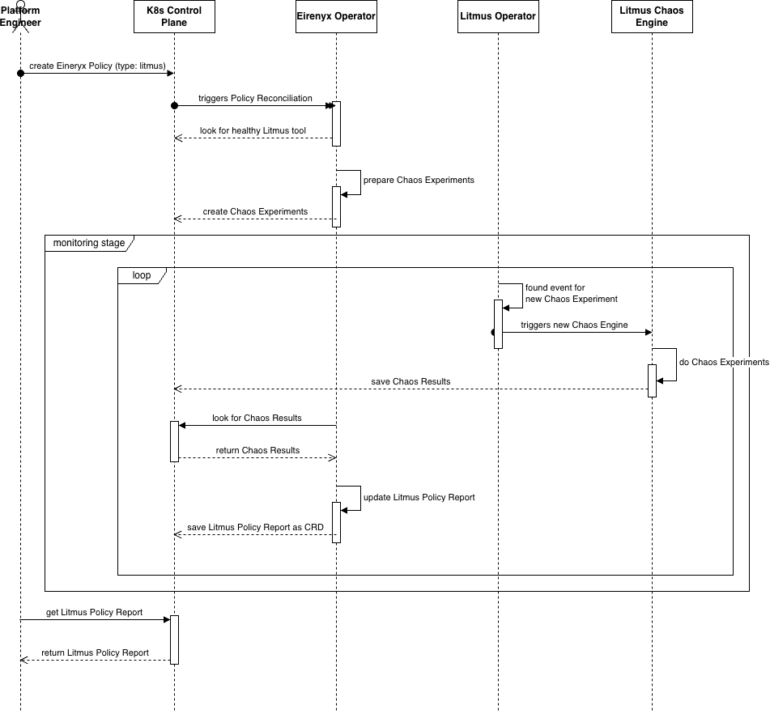

# Chapter 3D: Practical Implementation — Litmus Integration

---

## 3.8 Litmus Integration

### 3.8.1 Purpose and Role in Eirenyx

LitmusChaos is a Kubernetes-native chaos engineering framework that validates the resilience of workloads by
deliberately injecting controlled failures and measuring the system's response. It answers a question that neither Trivy
nor Falco can: *"does this service continue to function correctly when things go wrong?"*

The Principles of Chaos Engineering, introduced at Netflix and formalised in academic and industry literature, hold that
distributed systems will inevitably experience failures — network partitions, pod evictions, node failures, resource
exhaustion — and that teams should proactively discover their system's weaknesses in controlled conditions rather than
discovering them during production incidents. LitmusChaos operationalises this principle within Kubernetes through a
library of pre-built chaos experiments: pod deletion, CPU stress injection, network latency, disk fill, and others.

In Eirenyx, Litmus fills the **resilience validation role** in the temporal coverage model, complementing Trivy's
pre-deployment checks and Falco's runtime monitoring. A workload that passes Trivy (no known vulnerabilities) and is
clean in Falco (no anomalous runtime behaviour) may still fail under load or during a node failure — Litmus provides the
third pillar of assurance.

The integration gap that Eirenyx addresses for Litmus is identical to the gap it addresses for Trivy and Falco: without
Eirenyx, running a chaos experiment requires directly creating `ChaosEngine` and `ChaosResult` CRDs, understanding
Litmus's internal resource model, and manually correlating experiment results with the rest of the security posture.
Eirenyx wraps this in the same `Policy` and `PolicyReport` abstraction used for Trivy and Falco, providing a uniform
interface across all three tools.

### 3.8.2 How Litmus Works in the Cluster

When a Litmus `Tool` resource is created and enabled, the `ToolReconciler` installs the LitmusChaos Helm chart. Litmus
deploys a controller — the *chaos-operator* — that watches for `ChaosEngine` CRDs and executes the referenced
experiments. It also ships a library of pre-built `ChaosExperiment` CRDs (pod-delete, cpu-hog, network-latency, and
others) that define the experiment procedures.

The Litmus integration flow:

```
Policy (type: litmus) → ToolReconciler → Helm install (litmus-operator)
                                              ↓
PolicyReconciler → litmus.Engine → ChaosEngine CRDs (one per experiment)
                                              ↓
litmus-operator picks up ChaosEngine → creates chaos runner pod
                                              ↓
Chaos runner executes experiment against target workload
                                              ↓
litmus-operator writes ChaosResult CRD
                                              ↓
PolicyReportReconciler → LitmusReportHandler → writes PolicyReport
```

Litmus's execution model differs from Trivy's in a key way: each `ChaosEngine` runs continuously as long as it is
`active`. It is not a one-shot batch job — it is a persistent intent that causes experiments to be run on a schedule or
immediately when activated. The Eirenyx integration creates `ChaosEngine` objects with `engineState: active`, which
causes experiments to begin immediately.

### 3.8.3 The Litmus Policy Specification

A Litmus policy defines a list of chaos experiments to run. Each experiment specifies the chaos type to execute, the
target workload, and the duration and mode of chaos injection:

```yaml
apiVersion: eirenyx.io/v1alpha1
kind: Policy
metadata:
  name: pod-resilience
  namespace: eirenyx-system
spec:
  type: litmus
  enabled: true
  litmus:
    experiments:
      - name: pod-delete-test
        experimentRef: pod-delete
        appInfo:
          appNamespace: production
          appLabel: "app=my-api"
          appKind: deployment
        duration: "60"
        mode: "Solo"
        targetNamespace: production
      - name: cpu-stress-test
        experimentRef: pod-cpu-hog
        appInfo:
          appNamespace: production
          appLabel: "app=my-api"
          appKind: deployment
        duration: "120"
        mode: "Parallel"
        parameters:
          CPU_CORES: "2"
          CPU_LOAD: "80"
```

Each experiment entry maps to one `ChaosEngine` CRD. The fields translate directly to Litmus concepts:

| Field              | Litmus concept                                                                                   |
|--------------------|--------------------------------------------------------------------------------------------------|
| `experimentRef`    | Name of the `ChaosExperiment` CRD to use (must exist in the cluster)                             |
| `appInfo.appLabel` | Label selector identifying the target workload                                                   |
| `appInfo.appKind`  | Kubernetes workload type (`deployment`, `statefulset`, `daemonset`)                              |
| `duration`         | Mapped to `TOTAL_CHAOS_DURATION` environment variable                                            |
| `mode`             | Mapped to `CHAOS_MODE` (`Solo`: one pod at a time; `Parallel`: all matching pods simultaneously) |
| `parameters`       | Arbitrary key-value pairs passed as additional environment variables to the chaos runner         |

The `parameters` map is the mechanism for passing experiment-specific configuration. Each `ChaosExperiment` CRD
documents its configurable environment variables; the `parameters` map passes these through verbatim. This design is
consistent with the `spec.values` field in the `Tool` CRD: Eirenyx does not enumerate tool-specific options; it provides
a pass-through mechanism.

`Validate` checks that `spec.litmus` is non-nil, that the experiments list is non-empty, and that each experiment has a
valid `name`, `experimentRef`, and complete `appInfo` (namespace, label selector, and kind). These are the minimum
fields required for Litmus to locate and target the workload.

### 3.8.4 The Litmus Engine — Creating ChaosEngine Resources

The Litmus engine creates one `ChaosEngine` CRD per experiment entry. The engine name is deterministic:

```go
func getChaosEngineName(policy *eirenyx.Policy, expName string) string {
    return fmt.Sprintf("eirenyx-litmus-%s-%s", policy.Name, expName)
}
```

The engine uses `CreateOrUpdate` for idempotent management — consistent with the Falco engine's approach and in contrast
to Trivy's existence-check pattern. The difference is intentional: `ChaosEngine` objects are persistent state that may
be updated (e.g., when the policy's duration or mode is changed), so `CreateOrUpdate` is the correct pattern.

```go
engine := &litmus.ChaosEngine{
    ObjectMeta: metav1.ObjectMeta{
        Name:      getChaosEngineName(policy, exp.Name),
        Namespace: ns,
    },
}

controllerutil.CreateOrUpdate(ctx, e.Client, engine, func() error {
    engine.Spec = litmus.ChaosEngineSpec{
        EngineState: "active",
        AppInfo: litmus.ApplicationParams{
            Appns:    exp.AppInfo.AppNamespace,
            Applabel: exp.AppInfo.AppLabel,
            AppKind:  exp.AppInfo.AppKind,
        },
        Experiments: []litmus.ExperimentList{{
            Name: exp.ExperimentRef,
            Spec: litmus.ExperimentAttributes{
                Components: litmus.ExperimentComponents{
                    ENV: buildEnvVars(exp),
                },
            },
        }},
    }
    return controllerutil.SetControllerReference(policy, engine, e.Scheme)
})
```

Setting `EngineState: "active"` causes the Litmus operator to begin executing the experiment immediately when the
`ChaosEngine` is created or updated. This is the activation mechanism — the `enabled` field of the policy maps to this
field via the reconciler's enable/disable logic.

The `buildEnvVars` helper translates the experiment's `duration`, `mode`, and arbitrary `parameters` map into a slice of
`corev1.EnvVar`, which Litmus reads as environment variables inside the chaos runner pod:

```go
func buildEnvVars(exp eirenyx.LitmusExperiment) []corev1.EnvVar {
    envs := []corev1.EnvVar{}
    if exp.Duration != "" {
        envs = append(envs, corev1.EnvVar{Name: "TOTAL_CHAOS_DURATION", Value: exp.Duration})
    }
    if exp.Mode != "" {
        envs = append(envs, corev1.EnvVar{Name: "CHAOS_MODE", Value: exp.Mode})
    }
    for k, v := range exp.Parameters {
        envs = append(envs, corev1.EnvVar{Name: k, Value: v})
    }
    return envs
}
```

An experiment may target a namespace different from the one where the policy lives (`exp.TargetNamespace`). The engine
handles this by deploying the `ChaosEngine` into the target namespace directly. The `Cleanup` method tracks all
namespaces where engines were created to ensure they are all removed when the policy is disabled or deleted — a
necessary precaution since cross-namespace cleanup is not automatically handled by Kubernetes owner reference garbage
collection (owner references only cascade within the same namespace).

Standard labels are applied to each `ChaosEngine`:

```go
Labels: map[string]string{
    "app.kubernetes.io/managed-by": "eirenyx",
    "eirenyx.io/policy-name":       policy.Name,
    "eirenyx.io/policy-type":       "litmus",
    "eirenyx.io/litmus-experiment": exp.Name,
}
```

These labels serve both human discoverability (via `kubectl get chaosengines -l app.kubernetes.io/managed-by=eirenyx`)
and programmatic cleanup during `Cleanup` execution.

### 3.8.5 The Litmus Report Handler — Why Reports Work Differently

The `LitmusReportHandler` is intentionally simpler than the Trivy and Falco handlers. This simplicity is a design
decision grounded in the nature of chaos engineering, and understanding it requires understanding what the Litmus
integration is designed to deliver.

The current implementation generates a report immediately upon scheduling the experiments, rather than waiting for
`ChaosResult` CRDs to be written:

```go
total := len(policy.Spec.Litmus.Experiments)

newStatus.Summary = eirenyx.ReportSummary{
    TotalChecks: int32(total),
    Passed:      int32(total),
    Failed:      0,
    Verdict:     eirenyx.VerdictPass,
}
newStatus.Phase = eirenyx.ReportCompleted
newStatus.Details = createLitmusReportDetails(policy.Spec.Litmus.Experiments)
```

The rationale is that **the act of declaratively scheduling chaos experiments is the primary deliverable**. When a
platform team adopts chaos engineering, the first meaningful step is establishing that experiments are being run on a
regular, auditable basis. The `PolicyReport` records which experiments were scheduled, at what configuration, and for
which targets — this is already valuable audit information regardless of whether the workload survived the test.

Interpreting `ChaosResult` outcomes requires domain-specific knowledge: a pod delete experiment that causes a brief
service degradation may be acceptable (the deployment rolled over successfully) or unacceptable (the rollover took too
long). The verdict logic for this interpretation is planned as a future extension, where the handler will query
`ChaosResult` CRDs and apply configurable thresholds.

The handler includes a staleness check before writing results, to avoid unnecessary writes to etcd:

```go
if !statusEqual(policyReport.Status, *newStatus) {
    policyReport.Status = *newStatus
    return h.Client.Status().Update(ctx, policyReport)
}
```

The `statusEqual` function uses `reflect.DeepEqual` to compare the current and desired status. If nothing has changed,
the `Status().Update` call is skipped. This prevents the reconciler from generating spurious watch events in etcd —
every `Status().Update` call generates a new resource version, which triggers all watchers (including the reconciler
itself). The staleness guard breaks this potential feedback loop.

### 3.8.6 The Role of Litmus in the Overall Security Posture

Litmus completes the three-pillar security model of Eirenyx:

| Pillar         | Tool   | When                       | What it validates                           |
|----------------|--------|----------------------------|---------------------------------------------|
| Pre-deployment | Trivy  | Image build / deployment   | Known vulnerabilities in dependencies       |
| Runtime        | Falco  | Continuously while running | Anomalous and malicious behaviour           |
| Resilience     | Litmus | On demand / scheduled      | Continued function under failure conditions |

A workload that is clean in all three pillars has passed a comprehensive security and resilience baseline:

1. Its dependencies do not contain known exploitable vulnerabilities (Trivy: Pass).
2. Its runtime behaviour matches expectations — no unauthorised file access, no unexpected network connections, no
   spawned shells (Falco: Pass).
3. It continues to serve traffic correctly even when pods are deleted, nodes are drained, or CPU is constrained (Litmus:
   Pass).

Each of these assertions is expressed through the same `Policy` and `PolicyReport` API, visible in the same dashboard,
and queryable through the same REST API. This is the unified security interface that Eirenyx was designed to provide.



---

*Previous: [Chapter 3C — Falco Integration](03c-falco.md)*
*Next: [Chapter 3E — REST API](03e-api.md)*
